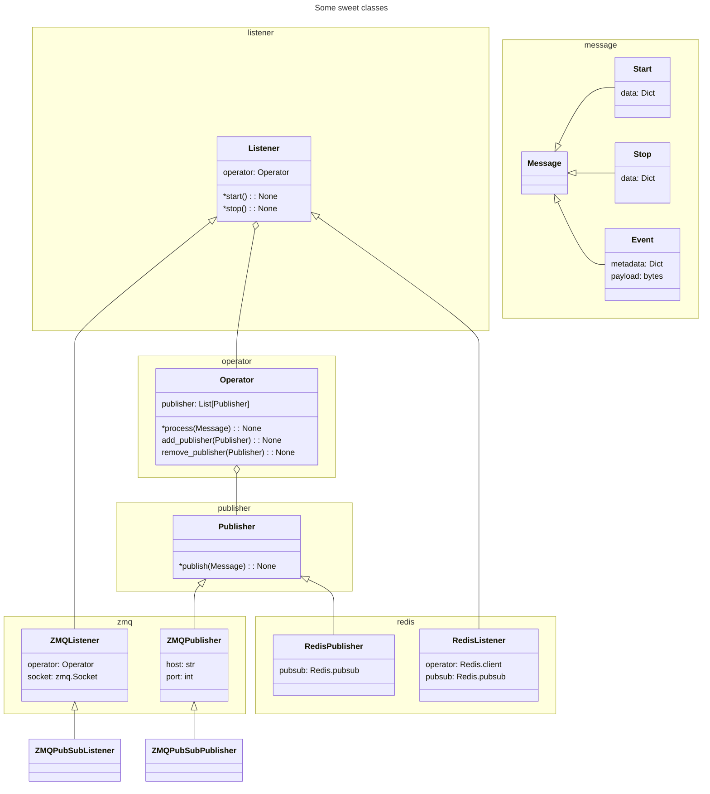
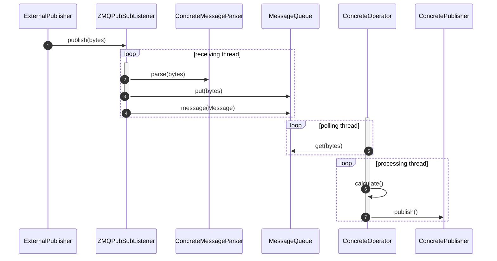

# Arroyo Stream Processing Toolset

Processing event or streaming data presents several technological challenges. A variety of technologies are often used by scientific user facilities. ZMQ is used to stream data and messages in a peer-to-peer fashion. Message brokers like Kafka, Redis and RabbitMQ are often employed to route and pass messages from instruments to processing workflows. Arroyo provides an API and structure to flexibly integrate with these tools and incorporate arbitrarily complex processing workflows, letting the hooks to the workflow code be independent of the connection code and hence reusable at a variety of instruments.

The basic structure of building an arroyo implementation is to implement groups of several  classes:
-
- `Operator` - receives `Messages` from a listener and can optionally send `Messages` to one or more `Publisher` instances
- `Listener` - receives `Messages` from the external world, parse them into arroyo `Message` and sends them to an `Operator`
- `Publisher` - receives `Messages` from a `Listener` and publishes them to the outside world


Arroyo is un-opinionated about deployment decsions. It is intended support listener-operator-publisher groups in:
- Single process
- Chain of processes where listening, processing and publishing can linked together through a protocol like ZMQ. One process's publisher can communicate with another process's listener, etc.

This library is intended to provide  classes, and will also include more specific common subclasses, like those that communicate over ZMQ or Redis.



##
In-process, listening for ZMQ

Note that this leaves Concrete classes undefined as placeholders

TODO: parent class labels



# Devloper installation

## Conda environment
We use pixi to be forward thinking tio help with CI. We like it because it helps you easily test that dependencies for a variety of architects can resolve.

However, at the time of writing we can't figure out how to get it to be a good developer experience. So, we create a conda environment like (note that at this time, we are using python 3.11 because of numpy and wheel availability):

```
conda create -n arroyo python=3.11
conda activate arroyo
pip install -e '.[dev]'
```

## pre-commit
We use `pre-commit` in CI so you want to use it before commiting.
To test that your branches changes are all good, type:

```
pre-commit run --all-files
```

Since our configuration of `pre-commit` uses `black`, it's possible that it will change files. If you like the changes, you can add them to your `git` commit with

```
git add .
```

Then you can run `pre-commit run --all-files` again.

## pixi
We use `pixi` for CI in github action. It's great for that but can't get our favorite developr tools to use the python environments that `pixi` creaetes in the `.pixi` folder. If you want to play with `pixi`, here are some tips:

To setup a development environment:

* Git clone this repo and CD into the directory
* Install [pixi](https://pixi.sh/v0.33.0/#installation)
* Install dependencies with
'''
pixi install
'''
* run pre-commit on the files
'''
pixi r pre-commit
'''


* Run pytest with
'''
pixi r test
'''

# Copyright
Arroyo Stream Processing Toolset (arroyopy) Copyright (c) 2025, The Regents of the University of California, through Lawrence Berkeley National Laboratory (subject to receipt of any required approvals from the U.S. Dept. of Energy).
All rights reserved.

If you have questions about your rights to use or distribute this software,
please contact Berkeley Lab's Intellectual Property Office at
IPO@lbl.gov.

NOTICE.  This Software was developed under funding from the U.S. Department
of Energy and the U.S. Government consequently retains certain rights.  As
such, the U.S. Government has been granted for itself and others acting on
its behalf a paid-up, nonexclusive, irrevocable, worldwide license in the
Software to reproduce, distribute copies to the public, prepare derivative
works, and perform publicly and display publicly, and to permit others to do so.
