# 🌀 bluer-sandbox

🌀 A sandbox for ideas and experiments.

## installation

```bash
pip install bluer-sandbox
```

## aliases

[@assets](./bluer_sandbox/docs/aliases/assets.md), 
[@notebooks](./bluer_sandbox/docs/aliases/notebooks.md), 
[@offline_llm](./bluer_sandbox/docs/aliases/offline_llm.md).

```mermaid
graph LR

    assets_publish["@assets<br>publish<br>extensions=png+txt,push<br>&lt;object-name&gt;"]

    notebooks_build["@notebooks<br>build<br>&lt;notebook-name&gt;"]

    notebooks_code["@notebooks<br>code<br>&lt;notebook-name&gt;"]
    
    notebooks_connect["@notebooks<br>connect<br>ip=&lt;ip-address&gt;"]

    notebooks_create["@notebooks<br>create<br>&lt;notebook-name&gt;"]

    notebooks_host["@notebooks<br>host"]

    notebooks_open["@notebooks<br>open<br>&lt;notebook-name&gt;"]

    offline_llm_install["@offline_llm<br>install"]

    offline_llm_prompt["@offline_llm<br>prompt -<br>&lt;prompt&gt;<br>&lt;object-name&gt;"]

    object["📂 object"]:::folder
    prompt["🗣️ prompt"]:::folder
    notebook["📘 notebook"]:::folder
    ip_address["🛜 <ip-address>"]:::folder

    notebook --> notebooks_build

    notebook --> notebooks_code

    ip_address --> notebooks_connect

    notebooks_host --> ip_address

    notebooks_create --> notebook

    notebook --> notebooks_open

    prompt --> offline_llm_prompt
    offline_llm_prompt --> object

    object --> assets_publish
```



|   |   |   |
| --- | --- | --- |
| [``@assets``](./bluer_sandbox/assets/) [](./bluer_sandbox/assets/) Asset management in [github/kamangir/assets](https://github.com/kamangir/assets). | [``@notebooks``](./bluer_sandbox/assets/template.ipynb) [](./bluer_sandbox/assets/template.ipynb) A bluer Jupyter Notebook. | [`offline LLM`](./bluer_sandbox/docs/offline_llm.md) [](./bluer_sandbox/docs/offline_llm.md) using [llama.cpp](https://github.com/ggerganov/llama.cpp). |

---

> 🌀 [`blue-sandbox`](https://github.com/kamangir/blue-sandbox) for the [Global South](https://github.com/kamangir/bluer-south).

---


[](https://github.com/kamangir/bluer-sandbox/actions/workflows/pylint.yml) [](https://github.com/kamangir/bluer-sandbox/actions/workflows/pytest.yml) [](https://github.com/kamangir/bluer-sandbox/actions/workflows/bashtest.yml) [](https://pypi.org/project/bluer-sandbox/) [](https://pypistats.org/packages/bluer-sandbox)

built by 🌀 [`bluer README`](https://github.com/kamangir/bluer-objects/tree/main/bluer_objects/README), based on 🌀 [`bluer_sandbox-5.50.1`](https://github.com/kamangir/bluer-sandbox).
