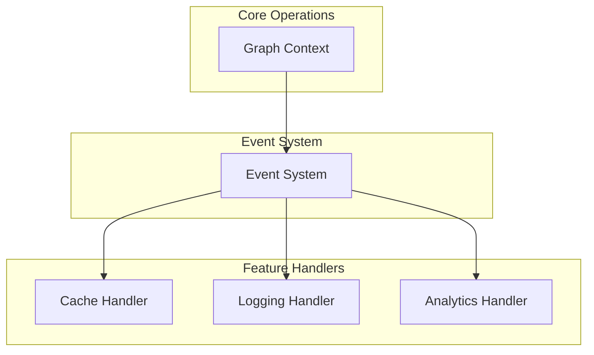
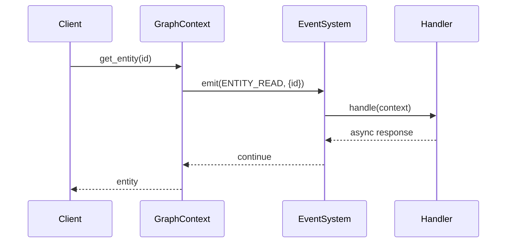
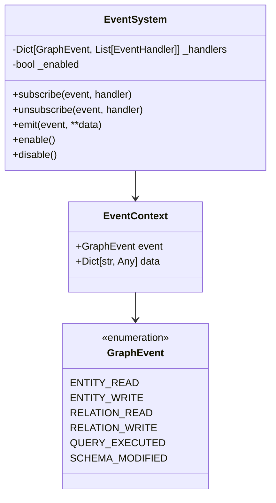

# Event System

## Overview

The event system provides a lightweight, flexible foundation for implementing cross-cutting concerns in the Graph Context component. It follows a simple pub/sub pattern where core graph operations emit events that can be subscribed to by various features without coupling the core implementation to those features.

## Design

### Architecture



### Event Flow



### Core Components



## Usage Examples

### Basic Usage

```python
from graph_context.event_system import EventSystem, GraphEvent

# Create an event system
events = EventSystem()

# Define a handler
async def log_entity_reads(context):
    print(f"Entity read: {context.data.get('entity_id')}")

# Subscribe to events
await events.subscribe(GraphEvent.ENTITY_READ, log_entity_reads)

# Emit events
await events.emit(
    GraphEvent.ENTITY_READ,
    entity_id="123",
    entity_type="user"
)
```

### Implementing Caching

```python
from typing import Dict, Any
from graph_context.event_system import EventSystem, GraphEvent, EventContext

class CacheHandler:
    def __init__(self):
        self._cache: Dict[str, Any] = {}

    async def handle_read(self, context: EventContext) -> None:
        """Cache hit/miss tracking."""
        entity_id = context.data.get('entity_id')
        if entity_id in self._cache:
            print(f"Cache hit: {entity_id}")
        else:
            print(f"Cache miss: {entity_id}")

    async def handle_write(self, context: EventContext) -> None:
        """Cache invalidation on writes."""
        entity_id = context.data.get('entity_id')
        if entity_id in self._cache:
            del self._cache[entity_id]
            print(f"Cache invalidated: {entity_id}")

    async def setup(self, events: EventSystem) -> None:
        """Register cache handlers."""
        await events.subscribe(GraphEvent.ENTITY_READ, self.handle_read)
        await events.subscribe(GraphEvent.ENTITY_WRITE, self.handle_write)
```

### Implementing Analytics

```python
from datetime import datetime
from graph_context.event_system import EventSystem, GraphEvent, EventContext

class AnalyticsHandler:
    def __init__(self):
        self._metrics = {
            'reads': 0,
            'writes': 0,
            'queries': 0
        }

    async def handle_event(self, context: EventContext) -> None:
        """Track operation metrics."""
        if context.event in {GraphEvent.ENTITY_READ, GraphEvent.RELATION_READ}:
            self._metrics['reads'] += 1
        elif context.event in {GraphEvent.ENTITY_WRITE, GraphEvent.RELATION_WRITE}:
            self._metrics['writes'] += 1
        elif context.event == GraphEvent.QUERY_EXECUTED:
            self._metrics['queries'] += 1

    async def setup(self, events: EventSystem) -> None:
        """Register analytics handlers."""
        for event in GraphEvent:
            await events.subscribe(event, self.handle_event)
```

## Integration with Graph Context

```python
class GraphContext:
    def __init__(self):
        self._events = EventSystem()
        self._cache = CacheHandler()
        self._analytics = AnalyticsHandler()

    async def setup(self):
        """Set up event handlers."""
        await self._cache.setup(self._events)
        await self._analytics.setup(self._events)

    async def get_entity(self, entity_id: str):
        """Example of event emission in core operations."""
        result = await self._get_entity(entity_id)
        await self._events.emit(
            GraphEvent.ENTITY_READ,
            entity_id=entity_id,
            result=result
        )
        return result
```

## Best Practices

1. **Event Granularity**
   - Keep events focused on core operations
   - Use meaningful data in event context
   - Don't leak implementation details

2. **Handler Design**
   - Keep handlers independent
   - Handle errors gracefully
   - Use async operations appropriately

3. **Performance Considerations**
   - Enable/disable events when needed
   - Keep handler operations lightweight
   - Use bulk operations when possible

4. **Testing**
   - Test handler logic independently
   - Verify event emissions
   - Test error scenarios

## Feature Implementation Guide

### Adding a New Feature

1. Define your handler class:
```python
class MyFeatureHandler:
    async def handle_event(self, context: EventContext) -> None:
        # Implement feature logic
        pass

    async def setup(self, events: EventSystem) -> None:
        # Subscribe to relevant events
        await events.subscribe(GraphEvent.ENTITY_READ, self.handle_event)
```

2. Register with Graph Context:
```python
context = GraphContext()
feature = MyFeatureHandler()
await feature.setup(context._events)
```

### Adding New Event Types

1. Add to GraphEvent enum:
```python
class GraphEvent(str, Enum):
    # ... existing events ...
    MY_NEW_EVENT = "category:action"
```

2. Emit in relevant places:
```python
await self._events.emit(
    GraphEvent.MY_NEW_EVENT,
    relevant_data="value"
)
```

## Error Handling

The event system provides error isolation between handlers:
- Handler errors don't affect other handlers
- Core operations continue even if handlers fail
- Errors should be logged for monitoring

Example error handling:
```python
async def safe_handler(context: EventContext) -> None:
    try:
        await actual_handler(context)
    except Exception as e:
        logging.error(f"Handler error: {e}")
```