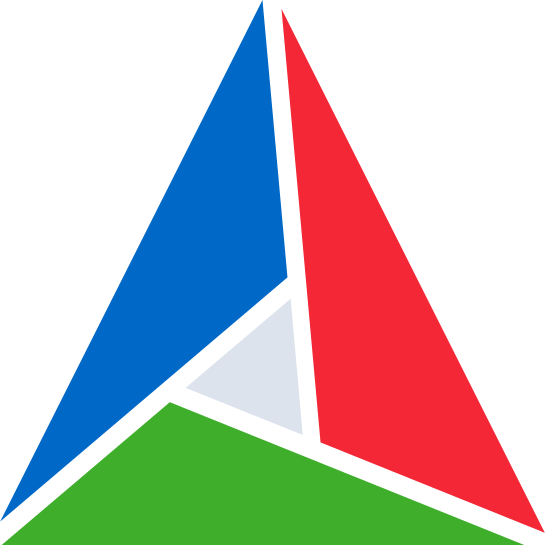
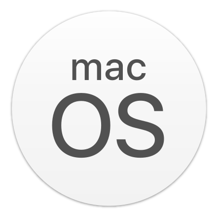
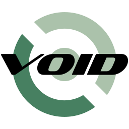
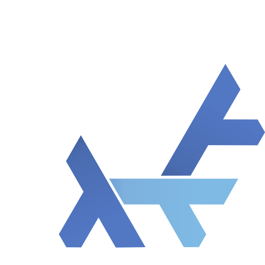
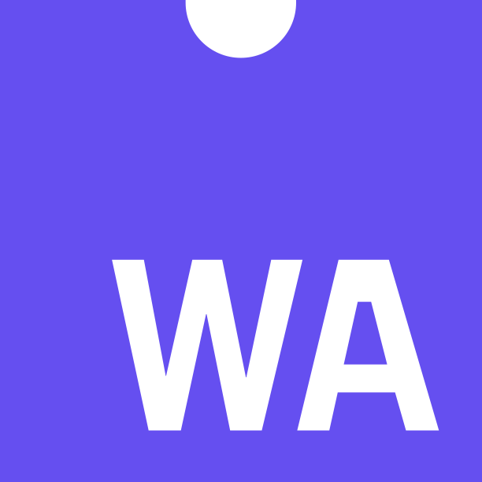

# Intermediate Project Representation Model

IPRM is to C++ build systems what LLVM is to CPU architectures.
One key goal is not to be yet another competitor to existing software in this space (e.g. CMake, Meson, Ninja, MSBuild,
GNU Make, QMake, SCons), just like
how LLVM is not a competitor to x86-64, Aarch64, and risc-v64. Instead, the goal is to be project
model/build system agnostic, enabling developer accessibility to a wide array of project
models/build systems via a common unified format. The actual project model or build
system used under the hood is up to the developer, allowing for ease of migration to
different backends, or to evaluate which backend is the most ideal for ones situation/preferences.

Developers act as the "compiler frontend", describing their large/complex C++ software project
in the .iprm format. Where-as typically an actual program is required/desired to emit the
intermediate representation, IPRM is designed so developers can do this manually because the
IPRM file format is just a python file that exposes an API tailor-made for all the varying tools
and strategies needed to describe C++ projects. IPRM then takes those files and acts as
the "compiler backend", taking its intermediate format and emitting a specific project model or
build system that can actually do the work of configuring, building, testing, and installing
C++ based projects

Another key goal is to maximize system resource utilization/parallelization during the build. There is a general 
focus/effort to delay as much work as possible (primarily third party/external resource retrieval/configuration) 
to be done at build time. This ensures targets are built as soon as their own dependencies have been built instead 
of having a "pre-build" phase where content is fetched and prepared in serial. Projects that migrate to IPRM, 
even if their original project was using the same system, have the potential to see a significant decrease in 
overall build time (starting from a clean repository), depending on how third party content was handled in their 
previous build infrastructure.

## Supported Backends

### Project Models

> [!NOTE]
> The list of generators for a project model means that IPRM uses them in the testsuite and can confirm their support. 
> Other generators a project model supports may also work, but they are untested.

    
    CMake

| Generators                                                                                                                                        |
|---------------------------------------------------------------------------------------------------------------------------------------------------|
| Ninja                                                                                                                                             |
|  Visual Studio |
|  Xcode                        |
|  GNU Make                         |

 

    
    Meson 

| Generators                                                                                                                                        |
|---------------------------------------------------------------------------------------------------------------------------------------------------|
| Ninja                                                                                                                                             |
|  Visual Studio |
|  Xcode                        |

### Build Systems

    
    SCons

 

    
    MSBuild 

### Plugins

    
    Dot

## Supported Platforms

> [!NOTE]
> 
> ❌ **Unsupported** means there are no plans to support the platform in the near future, or the platform itself has no 
> official support from the vendor(s). A stable version of IPRM can be released without supporting the platform and will 
> not be considered a bug, it is considered an optional enhancement.
> 
> ⚠️ **Untested** means I have not yet gotten access to the platform and have not confirmed if 
> everything works; however, it **_should_** work and will ideally change to ✅ before IPRM is considered stable. 
> If it doesn't work currently, that is considered a bug.

    
    Windows

| x86_64 | aarch64 | riscv64 |
|----|----|------|
| ✅  | ❌ Unsupported | ❌ Unsupported |

 

    
    macOS

| x86_64 | aarch64 | riscv64        |
|--------|---------|----------------|
| ⚠️ Untested | ✅ | ❌ Unsupported  |

 

    
    Linux

| x86_64 | aarch64 | riscv64 |
|--------|---------|---------|
| ✅ | ⚠️ Untested | ⚠️ Untested |

> [!NOTE]
> Support here means if IPRM can create third party targets that use system libraries from the distros native system 
> dependency management framework (typically a package manager).
> 
> For Distro's currently not supported, a raw system 
> target with hardcoded paths to the include paths and libraries can be done instead; however, that is not recommended 
> as it decreases the chance that the project will be portable on Linux

| Distro                                                                                                                                                                                                                                                       | Support                   |
|--------------------------------------------------------------------------------------------------------------------------------------------------------------------------------------------------------------------------------------------------------------|---------------------------|
|  Debian-like                                                                                                                           | ✅ `dpkg`|
|  Fedora-like | ✅ `rpm` |
| openSUSE    | ✅ `rpm` |
|  Arch-like                                                                                                                           | ❌ `pacman` |
|  Void Linux                                                                                                                          | ❌ `xbps` |
|  NixOS                                                                                                                                   | ❌ |

 

    
    Web Assembly

| x86_64 | aarch64 | riscv64 |
|--------|---|---------|
| ✅ | ✅ | ❌ Unsupported |

> [!NOTE]
> Web Assembly support currently requires the [emscripten](https://emscripten.org/) toolchain

## Supported Languages

    
    C++

 

    
    Rust

> [!NOTE]
> Rust support is very limited at the moment, as the current focus is on building out full C++ support.

## Building

See [build instructions](docs/building.md)

## Getting Started

See [documentation](docs/README.md)
