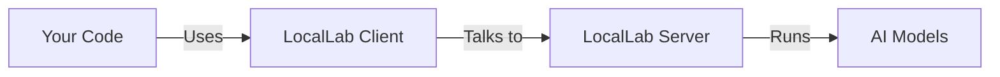

# 🚀 LocalLab: Your Personal AI Lab

LocalLab lets you run AI language models on your computer or Google Colab - no cloud services needed! Think of it as having ChatGPT-like capabilities right on your machine.

## 🤔 What is LocalLab?

LocalLab consists of two parts working together:



### The Server (Your AI Engine)

Think of the server as your personal AI engine. It:

- Downloads and runs AI models on your computer
- Manages memory and resources automatically
- Optimizes performance based on your hardware
- Provides a simple API for accessing models

You can run it:

- On your computer (local mode)
- On Google Colab (free GPU mode)

### The Client (Your AI Controller)

The client is how your code talks to the AI. It:

- Connects to your LocalLab server
- Sends requests for text generation
- Handles chat conversations
- Processes multiple requests at once
- Streams responses in real-time

## ✨ How It Works Together

When you use LocalLab:

1. **Server Setup**

   ```python
   from locallab import start_server
   start_server()  # Server starts and loads AI model
   ```

2. **Client Connection**

   ```python
    # Async Usage
        from locallab_client import LocalLabClient # Async client
        server_url = "http://localhost:8000" # or "https://your-ngrok-url.ngrok.app"
        client = LocalLabClient(server_url)
    # Sync Usage
        from locallab_client import SyncLocalLabClient # Sync client
        server_url = "http://localhost:8000" # or "https://your-ngrok-url.ngrok.app"
        client = SyncLocalLabClient(server_url)
   ```

3. **AI Interaction**

   ```python
   # Your code sends requests through the client
   # Async usage
   response = await client.generate("Write a story")
   print(response)  # Server processes and returns AI response

   # Or sync usage (New!)
   response = client.generate("Write a story")
   print(response)  # Same result, no async/await needed!
   ```

## 💡 Quick Examples

```python
# Install the client
# pip install locallab-client

# Import the appropriate client
from locallab_client import LocalLabClient       # Async client
from locallab_client import SyncLocalLabClient  # Sync client

# Generate text (async or sync)
response = await client.generate("Hello!")  # Async with LocalLabClient
response = client.generate("Hello!")        # Sync with SyncLocalLabClient

# Chat with AI (async or sync)
response = await client.chat([              # Async with LocalLabClient
    {"role": "user", "content": "Hi!"}
])
response = client.chat([                    # Sync with SyncLocalLabClient
    {"role": "user", "content": "Hi!"}
])

# Process multiple prompts (async or sync)
responses = await client.batch_generate([   # Async with LocalLabClient
    "Write a joke",
    "Tell a story"
])
responses = client.batch_generate([         # Sync with SyncLocalLabClient
    "Write a joke",
    "Tell a story"
])

```

[➡️ See More Examples](./docs/guides/examples.md)

## 💻 Requirements

**Local Computer:**

- Python 3.8+
- 4GB RAM minimum
- GPU optional (but recommended)

**Google Colab:**

- Just a Google account!
- Free tier works fine

## 📚 Getting Started

### 1. Choose Your Path

**New to AI/Programming?**

1. Start with our [Getting Started Guide](./docs/guides/getting-started.md)
2. Try the [Basic Examples](./docs/guides/examples.md)
3. Join our [Community](https://github.com/UtkarshTheDev/LocalLab/discussions)

**Developer?**

1. Check [API Reference](./docs/guides/api.md)
2. See [Client Libraries](./docs/clients/README.md)
3. Read [Advanced Features](./docs/guides/advanced.md)

### 2. Read the Docs

Our [Documentation Guide](./docs/README.md) will help you:

- Understand LocalLab's features
- Learn best practices
- Find solutions to common issues
- Master advanced features

## 🌟 Features

- **Easy Setup**: Just pip install and run
- **Multiple Models**: Use any Hugging Face model
- **Resource Efficient**: Automatic optimization
- **Privacy First**: All local, no data sent to cloud
- **Free GPU**: Google Colab integration
- **Flexible Client API**: Both async and sync clients available (New!)
- **Automatic Resource Management**: Sessions close automatically (New!)

[➡️ See All Features](./docs/features/README.md)

## 🔍 Need Help?

- Check [FAQ](./docs/guides/faq.md)
- Visit [Troubleshooting](./docs/guides/troubleshooting.md)
- Ask in [Discussions](https://github.com/UtkarshTheDev/LocalLab/discussions)

## 📖 Additional Resources

- [Contributing Guide](./docs/guides/contributing.md)
- [Changelog](./CHANGELOG.md)
- [License](./LICENSE)

---

Made with ❤️ by Utkarsh Tiwari
[GitHub](https://github.com/UtkarshTheDev) • [Twitter](https://twitter.com/UtkarshTheDev) • [LinkedIn](https://linkedin.com/in/utkarshthedev)
