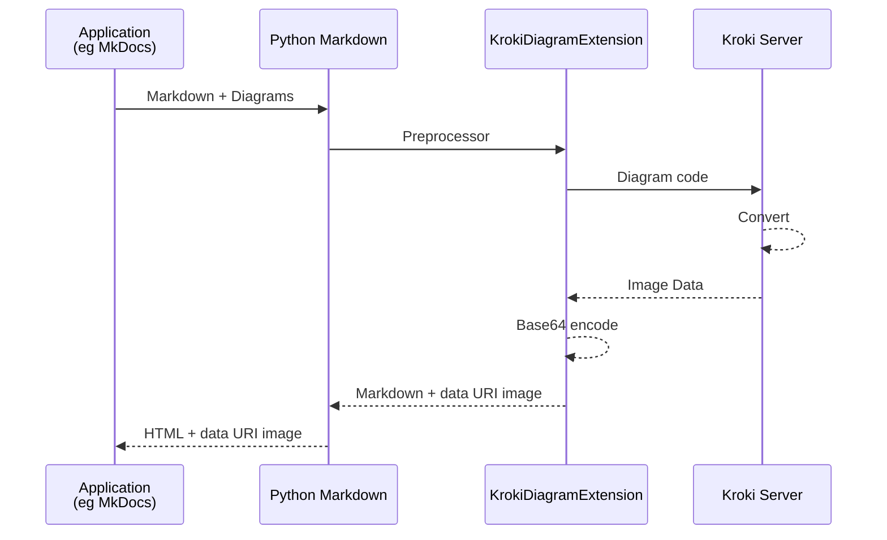

# [markdown-kroki](https://hkato.github.io/markdown-kroki/)

Diagram extension for [Python-Markdown][python-markdown] using [Kroki server][kuroki].

This extension converts various diagram code blocks into Base64 encoded [data: URI][data-uri].
This enables PDF generation with tools like [MkDocs to PDF][mkdocs-to-pdf]/[WeasyPrint][wasyprint] without requiring JavaScript, even during web browsing.

[mermaid]: https://mermaid.js.org/
[python-markdown]: https://python-markdown.github.io/
[kuroki]: https://kroki.io/
[data-uri]: https://developer.mozilla.org/en-US/docs/Web/URI/Reference/Schemes/data
[mkdocs-to-pdf]: https://mkdocs-to-pdf.readthedocs.io/
[wasyprint]: https://weasyprint.org/

## Install

```sh
pip install markdown-kroki
```

## Requirements

### Internet access to the public Kroki server

Default setting with no options.

### Self-Managed Kroki server (recommended)

Here is a sample Docker Compose file.

ref. Kroki.io > [Install](https://kroki.io/#install) > [Using Docker or Podman](https://docs.kroki.io/kroki/setup/use-docker-or-podman/)

```sh
docker compose up -d
```

> The default port used by MkDocs (`mkdocs serve`) may conflict with the default port of a Dockerized Kroki instance.
> Consequently, you will need to change the port configuration for one of them.

## Usage

````md
```{diagram language} formant=[svg|png] {img tag attribute}="value" {diagram option}="value"
```
````

### MkDocs Integration

```yaml
# mkdocs.yml
markdown_extensions:
  - markdown_kroki:
      kroki_url: http://localhost:18000  # default: https://kroki.io
```

### Python code

````python
import markdown
from markdown_kroki import KrokiDiagramExtension

markdown_text = """```plantuml format="svg" theme="sketchy-outline" width="300"
@startuml
Alice -> Bob: Authentication Request
Bob --> Alice: Authentication Response
@enduml
```"""

html_output = markdown.markdown(markdown_text, extensions=[
                                KrokiDiagramExtension(kroki_url='https://kroki.io')])

print(html_output)
````

```html
<p></p>
```

## Process flow


