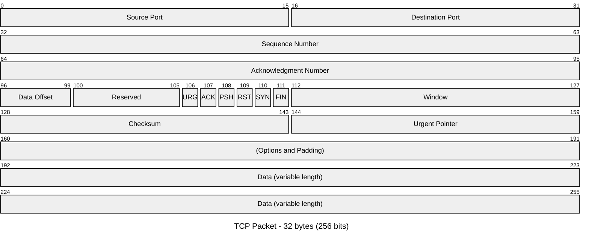
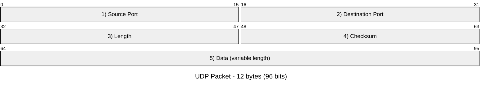

# mermaid_diagram

Python package for generating the string which represents a [Mermaid diagram](https://mermaid.js.org).

It provides methods to build your diagram. The resulting diagram is returned
as a `string`, either bare or enclosed within a Markdown code block.
This package **cannot** produce image files of the diagrams.

**Use cases:**

- Include Mermaid diagrams (generated from data) in a markdown file
  which gets created using Python script.

## Installation

You can install the package using pip:

```bash
pip install mermaid_diagram
```

## Supported diagrams

This package supports the following Mermaid diagrams:

-  Packet diagram (`packet-beta`).

## Usage

### Packet diagram

In this first example we build a diagram of the TCP packet,
using the `add_segment_bytes` and `add_segment_bits` methods.
To include the total packet size in the title, it uses the `size_in_bytes` and
`size_in_bits` getters.
Finally, the diagram string is returned as markdown code block.

```py
from mermaid_diagram import Packet

d = Packet()
d.add_segment_bytes(2, "Source Port")
d.add_segment_bytes(2, "Destination Port")
d.add_segment_bytes(4, "Sequence Number")
d.add_segment_bytes(4, "Acknowledgment Number")
d.add_segment_bits(4, "Data Offset")
d.add_segment_bits(6, "Reserved")
d.add_segment_bits(1, "URG")
d.add_segment_bits(1, "ACK")
d.add_segment_bits(1, "PSH")
d.add_segment_bits(1, "RST")
d.add_segment_bits(1, "SYN")
d.add_segment_bits(1, "FIN")
d.add_segment_bytes(2, "Window")
d.add_segment_bytes(2, "Checksum")
d.add_segment_bytes(2, "Urgent Pointer")
d.add_segment_bytes(4, "(Options and Padding)")
d.add_segment_bytes(8, "Data (variable length)")
d.title = f"TCP Packet - {d.size_in_bytes} bytes ({d.size_in_bits} bits)"
print(d.diagram_markdown)

# ```mermaid
# ---
# title: "TCP Packet - 32 bytes (256 bits)"
# ---
# packet-beta
# 0-15 : "Source Port"
# 16-31 : "Destination Port"
# 32-63 : "Sequence Number"
# 64-95 : "Acknowledgment Number"
# 96-99 : "Data Offset"
# 100-105 : "Reserved"
# 106 : "URG"
# 107 : "ACK"
# 108 : "PSH"
# 109 : "RST"
# 110 : "SYN"
# 111 : "FIN"
# 112-127 : "Window"
# 128-143 : "Checksum"
# 144-159 : "Urgent Pointer"
# 160-191 : "(Options and Padding)"
# 192-255 : "Data (variable length)"
# ```
```

Which renders as:



In the next example we activate the `use_number_prefix` option, so that every
segment gets a number prefix (e.g. `1) First segment`).
This can be helpful if the diagram will be accompanied by a numbered list
where the segments are explained in detail.

```py
from mermaid_diagram import Packet

d = Packet()
d.use_number_prefix = True
d.add_segment_bytes(2, "Source Port")
d.add_segment_bytes(2, "Destination Port")
d.add_segment_bytes(2, "Length")
d.add_segment_bytes(2, "Checksum")
d.add_segment_bytes(4, "Data (variable length)")
d.title = f"UDP Packet - {d.size_in_bytes} bytes ({d.size_in_bits} bits)"
print(d.diagram_markdown)

# ```mermaid
# ---
# title: "UDP Packet - 12 bytes (96 bits)"
# ---
# packet-beta
# 0-15 : "1) Source Port"
# 16-31 : "2) Destination Port"
# 32-47 : "3) Length"
# 48-63 : "4) Checksum"
# 64-95 : "5) Data (variable length)"
# ```
```

Which renders as:



## Known issues

- No input validation or error handling.
