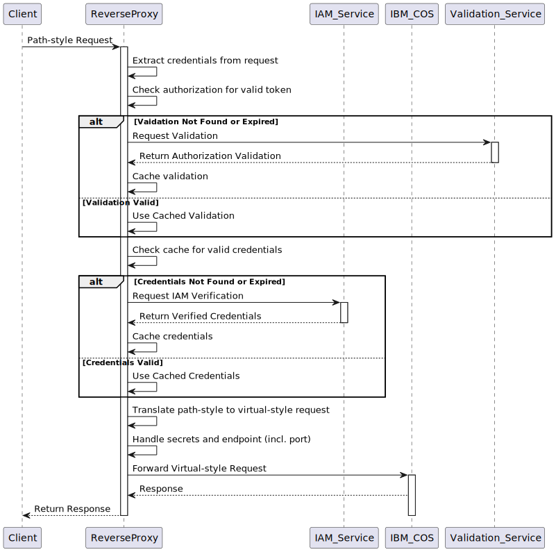

[](https://github.com/opensourceworks-org/object-storage-proxy/actions/workflows/ci.yml)


# <object-storage-proxy ⚡> Yet Another Object Storage Reverse Proxy

> 📌 **Note:** This project is still under heavy development, and its APIs are subject to change.

## Introduction

A fast and safe reverse proxy server, based on Cloudflare's [pingora](https://github.com/cloudflare/pingora?tab=readme-ov-file), to reverse proxy IBM Cloud Object Storage buckets.

- [x] Takes a Python validator function and cos bucket dictionary.
- [x] The validation is cached with optional ttl.
- [x] The apikey is used to authenticate against IBM's IAM endpoint and is cached and renewed on expiration.
- [x] If no apikey is provided, a Python function can be passed in to fetch the apikey for any given bucket.
- [ ] HMAC support: passing in access and secret id keys, will be used to sign the request

The bucket dict contains for each bucket:
    - endpoint host
    - port
    - api key (optional)
    - ttl (optional, default 300) -> keep this reasonably short, but size to your needs

```json
cos_map = {
    "bucket1": {
        "host": "s3.eu-de.cloud-object-storage.appdomain.cloud",
        "port": 443,
        "apikey": apikey,
        "ttl": 0
    },
    "bucket2": {
        "host": "s3.eu-de.cloud-object-storage.appdomain.cloud",
        "port": 443,
        "apikey": apikey
    },
    "proxy-bucket01": {
        "host": "s3.eu-de.cloud-object-storage.appdomain.cloud",
        "port": 443,
        "ttl": 300
    }
}
```


### secrets
IBM COS Storage is built in a way where buckets are grouped by a cos (Cloud Object Storage) instance.  Access to a bucket is managed by either an api key or hmac secrets, configured on the cos instance.  

### endpoint
Each bucket has its own endpoint: <bucket_name>.s3.<region>.cloud-object-storage.appdomain.cloud:<port>.

The port is not always different, though, but it might be.  Depends on your implementation.

You can imagine managing multiple buckets across instances can become quite cumbersome, even with aws profiles etc.


### solution
There are two ways to access a bucket: through virtual addressing style (bucket.ibm-cos-host:port) and path style (ibm-cos-host/bucket).

your client (aws s3 compatible) -> http(s)://this-proxy/bucket01 -> https://bucket01.s3.eu-de.cloud-object-storage.appdomain.cloud:443

1) translate path style to virtual style
2) abstract authentication & authorization


Pass in a function which maps bucket to instance (credentials), and a function to map bucket to port (endpoint)




# authentication & authorization
The advantage is we can plug in a python authentication function and another function for authorization, allowing for fine-grained control.

## authentication
We use the standard aws hmac header.

## authorization
Pass in a callable from python which will be called from rust.  This will be cached (ttl) for consequtive requests.

# Examples

With local configuration.

~/.aws/config
```ini
[profile osp]
region = eu-west-3
output = json
services = pingora-services
s3 =
    addressing_style = path

[services osp-services]
s3 =
  endpoint_url = http://localhost:6190
```

~/.aws/credentials
```ini
[osp]
aws_access_key_id = MYLOCAL123
aws_secret_access_key = nothingmeaningful
```

Set up a minimal server implementation:

```python
from object_storage_proxy import start_server, ProxyServerConfig
from dotenv import load_dotenv
import os
import random


load_dotenv()


def docreds(bucket) -> str:
    apikey = os.getenv("COS_API_KEY")
    if not apikey:
        raise ValueError("COS_API_KEY environment variable not set")
    
    print(f"Fetching credentials for {bucket}...")
    return apikey

def do_validation(token: str, bucket: str) -> bool:
    print(f"PYTHON: Validating headers: {token} for {bucket}...")
    # return random.choice([True, False])  # pointless now since cached
    return True


def main() -> None:
    apikey = os.getenv("COS_API_KEY")
    if not apikey:
        raise ValueError("COS_API_KEY environment variable not set")

    cos_map = {
        "bucket1": {
            "host": "s3.eu-de.cloud-object-storage.appdomain.cloud",
            "port": 443,
            "apikey": apikey,
            "ttl": 0
        },
        "bucket2": {
            "host": "s3.eu-de.cloud-object-storage.appdomain.cloud",
            "port": 443,
            "apikey": apikey
        },
        "proxy-bucket01": {
            "host": "s3.eu-de.cloud-object-storage.appdomain.cloud",
            "port": 443,
            "ttl": 300
        }
    }

    ra = ProxyServerConfig(
        bucket_creds_fetcher=docreds,
        validator=do_validation,
        cos_map=cos_map,
        port=6190
    )

    start_server(ra)


if __name__ == "__main__":
    main()

```

Run with [aws-cli](https://docs.aws.amazon.com/cli/latest/userguide/getting-started-install.html) (but could be anything compatible with the aws s3 api like polars, spark, presto, ...):

```bash
$ aws s3 ls s3://proxy-bucket01/ --recursive --summarize --human-readable --profile osp
2025-04-17 17:45:30   33 Bytes README.md
2025-04-17 17:48:04   33 Bytes README2.md

Total Objects: 2
   Total Size: 66 Bytes
$
```

Server output:

```log
$ uv run python test_server.py
2025-04-19T13:19:54.402023+02:00  INFO object_storage_proxy: Logger initialized; starting server on port 6190
2025-04-19T13:19:54.402361+02:00  INFO object_storage_proxy: Bucket creds fetcher provided: Py(0x100210680)
Fetching credentials for bucket01...
2025-04-19T13:19:54.402485+02:00  INFO object_storage_proxy: Callback returned: Kn2t...
[src/lib.rs:327:5] &run_args.cos_map = Py(
    0x000000010061aa00,
)
2025-04-19T13:19:54.403738+02:00  INFO pingora_core::server: Bootstrap starting
2025-04-19T13:19:54.403852+02:00  INFO pingora_core::server: Bootstrap done
2025-04-19T13:19:54.424489+02:00  INFO pingora_core::server: Server starting
PYTHON: Validating headers: MYLOCAL123 for proxy-bucket01...
2025-04-19T13:19:58.124729+02:00  INFO object_storage_proxy::utils::validator: Callback returned: false
PYTHON: Validating headers: MYLOCAL123 for proxy-bucket01...
2025-04-19T13:20:00.919320+02:00  INFO object_storage_proxy::utils::validator: Callback returned: true
2025-04-19T13:20:01.181775+02:00  INFO object_storage_proxy::credentials::secrets_proxy: No cached token found for proxy-bucket01, fetching ...
2025-04-19T13:20:01.181859+02:00  INFO object_storage_proxy::credentials::secrets_proxy: Fetching bearer token for the API key
2025-04-19T13:20:01.739385+02:00  INFO object_storage_proxy::credentials::secrets_proxy: Received access token
2025-04-19T13:20:01.739600+02:00  INFO object_storage_proxy::credentials::secrets_proxy: Fetched new token for proxy-bucket01
2025-04-19T13:20:01.739668+02:00  INFO object_storage_proxy: Sending request to upstream: https://proxy-bucket01.s3.eu-de.cloud-object-storage.appdomain.cloud/?list-type=2&prefix=&encoding-type=url
2025-04-19T13:20:01.739922+02:00  INFO object_storage_proxy: Request sent to upstream.
```


# Status

- [x] pingora proxy implementation
- [x] pass in credentials handler
- [x] cache credentials
- [x] pass in bucket/instance and bucket/port config
- [x] <del>split in workspace crate with core, cli and python crates</del> (too many specifics for python)
- [x] config mgmt
- [x] cache authorization (with optional ttl)