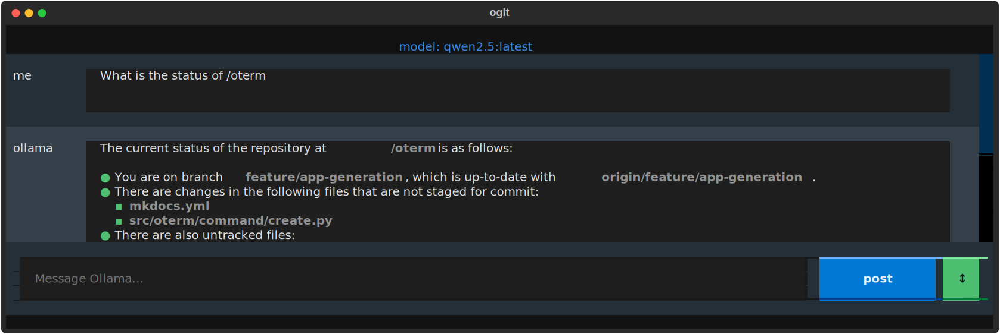

### Creating a command

!!! Note
    Do you find yourself running `oterm` to get to this one chat that you use all the time? You can create a custom command to get there faster.

You can create custom commands that can be run from the terminal using oterm. Each of these commands is a chat, customized to your liking and connected to the tools of your choice.

To create a custom command, you can call the `oterm-command` command:


```bash
oterm-command create <command-name>
```
which will present you with the same interface as when creating a chat. You can choose the model, the system propmt, the tools you want to use, etc.

`oterm-command` will create a self-managed command in `~/.local/bin` (make sure the directory is in your `PATH`) that you can call anytime.

For example, here is the command `ogit` that I use to chat about my repositories:



It is a chat with the `git` MCP tool, running using the `qwen2.5` model.

### Listing commands

You can list all the commands (id, name & path) you have created with the `oterm-command` command:

```bash
oterm-command list
Commands found:
64: ogit -> /Users/ggozad/.local/bin/ogit
```

### Deleting a command

You can delete a command with the `oterm-command` command:

```bash
$ oterm-command delete <command-id>
```
