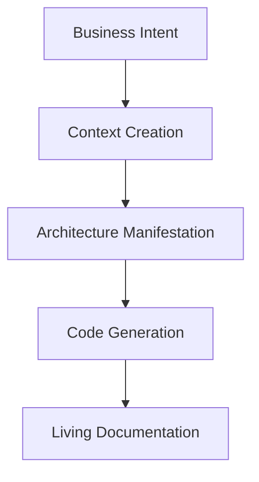

# 🧠 PAELLADOC: The AI-First Development Framework


[](https://github.com/jlcases/paelladoc)
[](https://x.com/i/communities/1907494161458090406)

> "In the AI era, context isn't supplementary to code—it's the primary creation."

PAELLADOC is a Multi-Capability Port (MCP) that implements the [5 Philosophical Principles of AI-First Development](https://paelladoc.com/blog/ai-first-development-principles/), transforming how we create software in the age of AI.

## 🎯 What is an MCP?

A Multi-Capability Port (MCP) is a protocol that allows Large Language Models (LLMs) to interact with your development environment. PAELLADOC is an MCP that provides AI-First development capabilities to any LLM that supports the protocol.

## 🎯 The AI-First Philosophy

Traditional development treats documentation as an afterthought. AI-First Development inverts this paradigm:
- Context becomes the primary artifact
- Code becomes its manifestation
- Knowledge evolves alongside systems
- Decisions preserve their philosophical context
- Human-AI collaboration is seamless

## 🧠 The Five Principles in Action

### 1. Context as Primary Creation
```python
# Traditional Way
write_code() -> document()

# PAELLADOC Way
create_context() -> manifest_as_code()
```
- Every artifact has a UUID for perfect traceability
- Context is versioned alongside code
- Knowledge graphs capture relationships
- Intent is preserved at every step

### 2. Intent-Driven Architecture

- Architecture flows from intent, not implementation
- Every decision captures its philosophical context
- Systems adapt to evolving purpose

### 3. Knowledge as Living Entity
```bash
# Knowledge evolves with your system
paella continue my-project
```
- Project memory tracks evolution of understanding
- Documentation updates automatically with changes
- Context remains fresh and relevant
- Knowledge graphs show relationships

### 4. Human-AI Collaborative Consciousness
```python
# Not just code generation, but true collaboration
with paelladoc.context() as ctx:
    ctx.understand_intent()
    ctx.propose_solutions()
    ctx.implement_with_human()
```
- Natural language conversations
- Intent preservation
- Contextual awareness
- Seamless collaboration

### 5. Contextual Decision Architecture
```yaml
decision:
  id: uuid-123
  intent: "Why we chose this path"
  context: "What we knew at the time"
  alternatives: "What we considered"
  implications: "Future impact"
```
- Every decision preserves its context
- Future developers understand the "why"
- Changes respect historical context
- Intent remains clear

## 🚀 Installation & Integration

### 1. Install the MCP Server

```bash
pip install paelladoc
```

### 2. Use with Your Favorite LLM

#### Cursor IDE
```python
# In your Cursor settings, add PAELLADOC as an MCP:
{
    "mcps": {
        "paelladoc": {
            "host": "localhost",
            "port": 8000
        }
    }
}
```

#### Claude
```python
# In your Claude conversation:
Using the PAELLADOC MCP at localhost:8000, let's start a new project...
```

#### GitHub Copilot
```python
# In your .copilot/mcps.json:
{
    "paelladoc": {
        "endpoint": "http://localhost:8000"
    }
}
```

### 3. Let the LLM Guide You

Once connected, your LLM will have access to all PAELLADOC commands:

- `PAELLA`: Start new documentation projects
- `CONTINUE`: Continue existing documentation
- `VERIFY`: Verify documentation coverage
- `GENERATE`: Generate documentation or code

The LLM will handle all the complexity - you just need to express your intent in natural language!

## 🚀 Quick Start

```bash
# Initialize with AI-First principles
paella new my-project --ai-first

# Let the context guide you
paella continue my-project
```

## 📊 MECE Documentation Structure

Our AI-First taxonomy ensures complete context preservation:

```
project/
├── intent/           # Business and technical intent
├── context/          # Living knowledge base
├── decisions/        # Contextual decision records
├── architecture/     # Intent-driven design
└── manifestation/    # Generated code and docs
```

## 🛠️ Key Features

- **Intent Preservation**: Every artifact maintains its philosophical context
- **Living Knowledge**: Documentation that evolves with your system
- **Context-First Generation**: Generate code from preserved context
- **Decision Architecture**: Capture the "why" behind every choice
- **Human-AI Bridge**: Seamless collaboration between human and AI

## 🎓 Learning the AI-First Way

1. Start with intent, not implementation
2. Let context drive architecture
3. Preserve knowledge as it evolves
4. Collaborate with AI naturally
5. Document decisions with their context

## 🌟 Success Stories

Teams using PAELLADOC report:
- 40% reduction in context loss
- 60% faster onboarding
- 80% better decision understanding
- 90% more maintainable AI-generated code

## 🤝 Join the AI-First Revolution

We're building the future of software development. Join us:

- [X Community](https://x.com/i/communities/1907494161458090406)
- [Read the Manifesto](https://paelladoc.com/blog/ai-first-development-principles/)
- [Contribute](CONTRIBUTING.md)

## 📚 Learn More

- [AI-First Development Guide](docs/ai-first-guide.md)
- [Context-First Architecture](docs/context-architecture.md)
- [Decision Preservation](docs/decision-preservation.md)
- [Human-AI Collaboration](docs/human-ai-collaboration.md)

## 📄 License

This project is licensed under the MIT License - see the [LICENSE](LICENSE) file for details.

---

*PAELLADOC: Because in the AI era, context is everything.*

# PAELLADOC - Intelligent Documentation System

PAELLADOC is a revolutionary documentation system that follows a MECE (Mutually Exclusive, Collectively Exhaustive) taxonomy to ensure complete and organized documentation throughout your project's lifecycle.

## 🎯 What is PAELLADOC?

PAELLADOC is a Multi-Capability Port (MCP) that can be integrated into various AI platforms to provide intelligent documentation assistance. It uses a comprehensive MECE taxonomy to ensure that no aspect of your project's documentation is overlooked.

### Key Features

- 📚 **MECE Taxonomy-Based Documentation**: Organized into clear categories:
  - `Initiate`: Project setup and initial documentation
  - `Elaborate`: Research, design, and planning
  - `Govern`: Standards, verification, and memory management
  - `Generate`: Documentation and code generation
  - `Deploy`: Deployment documentation
  - `Operate`: Operational documentation
  - `Iterate`: Continuous improvement documentation

- 🤖 **Multi-Platform Integration**: Use PAELLADOC with:
  - Cursor IDE
  - Anthropic's Claude
  - Windsurf
  - Any platform supporting the MCP protocol

- 🔄 **Smart Memory Management**: SQLite-based project memory with:
  - UUID-based artifact tracking
  - Version control integration
  - Automatic context generation

## 🚀 Quick Start

### 1. Installation

```bash
pip install paelladoc
```

### 2. Platform Integration

#### Cursor IDE
```python
from paelladoc import PaellaDocMCP

# Initialize in Cursor
mcp = PaellaDocMCP()
mcp.register_with_cursor()
```

#### Claude
```python
# In your Claude conversation
from paelladoc.integrations import claude
claude.register_paelladoc()
```

#### Windsurf
```python
# In your Windsurf configuration
import paelladoc.windsurf as pdw
pdw.enable_paelladoc()
```

### 3. Basic Usage

1. Start a new documentation project:
```bash
paella new my-project
```

2. Follow the interactive prompts to:
   - Select documentation templates
   - Define project scope
   - Set up initial documentation structure

3. Use the MECE commands:
```bash
paella continue  # Continue documentation work
paella verify   # Verify documentation coverage
paella generate # Generate documentation from code
```

## 📊 MECE Documentation Structure

Our taxonomy ensures complete documentation coverage:

```
paelladoc/
├── .cursor/rules/              # MECE-structured system rules
│   ├── orchestrator/           # Central command definitions
│   ├── commands/               # Categorized command implementations 
│   ├── modules/                # Core functional modules
│   ├── config/                 # System configuration
│   ├── scripts/                # Utility scripts
│   └── docs/                   # System documentation
├── code_context/               # Processed repository content
│   ├── extracted/              # Repositories extracted as text
│   └── generated/              # Generated documentation
├── docs/                       # Project documentation
└── README.md                   # This file
```

For more detailed information about the system architecture, see `.cursor/rules/docs/README.md`.

- **Architectural Change Detection**: Identifies changes that impact system architecture
- **Decision Lifecycle Management**: Tracks status of decisions (Proposed → Accepted → Implemented)
- **Cross-Referencing**: Links decisions to affected components and requirements
- **Status Updates**: Automatically marks decisions as superseded or deprecated when appropriate
- **Revision History**: Maintains complete historical context of architectural decisions

### 3. Advanced Document Generation

- **Intelligent Templates**: Context-aware templates with standardized sections
- **Proper Timestamping**: Automatic date management with consistent formatting
- **Frontmatter Management**: YAML frontmatter with metadata for all documents
- **Variable Substitution**: Template variables automatically populated from context
- **Document Validation**: Structure and content validation against standards

### 4. Professional Integration

- **Memory System**: Continuous project memory to maintain context between sessions
- **Template Flexibility**: Multiple template categories for different documentation needs
- **Multilingual Support**: Documentation in multiple languages from a single source
- **Cursor Integration**: Seamless operation within Cursor IDE

### 5. Documentation to Development Bridge

```bash
# Generate code from documentation
GENERATE_CODE projectname

# Create a new repository for generated code
CREATE_REPO repo_name="my-project" repo_type="github"
```

- **Documentation Completeness Tracking**: Automatically tracks completion percentage
- **Code Generation**: Creates full applications from completed documentation
- **Development Rules Extraction**: Identifies patterns, rules, and guidelines from docs
- **Seamless Transition**: Bridges the gap between documentation and development
- **Context Preservation**: Maintains all project context for AI-assisted development

### 6. Complete Product Management Suite

```bash
# Create a new user story
STORY operation="create" title="User registration" description="As a user, I want to register..."

# Plan a sprint
SPRINT operation="plan" name="Sprint 1" start_date="2024-07-15" end_date="2024-07-29"

# Record meeting notes
MEETING operation="create" title="Sprint planning" date="2024-07-14"

# Generate a sprint report
REPORT report_type="sprint" sprint_id="SP-1"
```

- **User Story Management**: Create, update, and track user stories
- **Sprint Planning**: Plan sprints with capacity and velocity tracking
- **Meeting Management**: Record and distribute meeting notes with action items
- **Task Tracking**: Manage tasks with assignees, due dates, and dependencies
- **Progress Reporting**: Generate comprehensive status reports
- **Visualization**: Create burndown charts and other visual aids

## 🛠️ Professional Commands

| Command | Description | Example |
|---------|-------------|---------|
| `PAELLA` | Start new documentation project | `PAELLA new-product` |
| `CONTINUE` | Continue existing documentation | `CONTINUE new-product` |
| `GENERATE_CODE` | Generate code from documentation | `GENERATE_CODE new-product` |
| `CREATE_REPO` | Create repository for code | `CREATE_REPO repo_name="new-product"` |
| `STORY` | Manage user stories | `STORY operation="create" title="User login"` |
| `TASK` | Manage tasks | `TASK operation="create" title="Implement login form"` |
| `SPRINT` | Manage sprints | `SPRINT operation="create" name="Sprint 1"` |
| `MEETING` | Manage meeting notes | `MEETING operation="create" title="Planning"` |
| `REPORT` | Generate reports | `REPORT report_type="sprint" sprint_id="SP-1"`