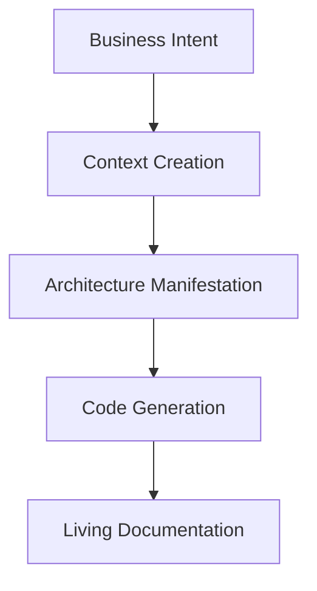

# 🧠 PAELLADOC: The AI-First Development Framework


[](https://github.com/jlcases/paelladoc)
[](https://x.com/i/communities/1907494161458090406)

> **Version 0.3.0**: This release marks a significant step, focusing PAELLADOC as an implementation of Anthropic's **Model Context Protocol (MCP)**, enabling powerful AI-First development workflows through LLM interaction.

> "In the AI era, context isn't supplementary to code—it's the primary creation."

PAELLADOC is an **AI-First Development framework** that implements the [5 Philosophical Principles of AI-First Development](https://paelladoc.com/blog/ai-first-development-principles/), transforming how we create software in the age of AI.

## 🎯 PAELLADOC and the Model Context Protocol (MCP)

PAELLADOC implements Anthropic's **Model Context Protocol (MCP)** ([see Anthropic's news](https://www.anthropic.com/news/model-context-protocol)). This protocol provides a structured way for Large Language Models (LLMs) to interact with external tools and context, enabling more sophisticated capabilities.

By implementing MCP, PAELLADOC allows LLMs to leverage its specific AI-First development tools and workflows directly through this standard. This approach facilitates functionalities similar to **Tool Use** or **Function Calling** seen in other platforms, but specifically utilizes the Anthropic MCP standard for interaction.

## 🎯 The AI-First Philosophy

Traditional development treats documentation as an afterthought. AI-First Development inverts this paradigm:
- Context becomes the primary artifact
- Code becomes its manifestation
- Knowledge evolves alongside systems
- Decisions preserve their philosophical context
- Human-AI collaboration is seamless

## 🧠 The Five Principles in Action

### 1. Context as Primary Creation
```python
# Traditional Way
write_code() -> document()

# PAELLADOC Way
create_context() -> manifest_as_code()
```
- Every artifact has a UUID for perfect traceability
- Context is versioned alongside code
- Knowledge graphs capture relationships
- Intent is preserved at every step

### 2. Intent-Driven Architecture

- Architecture flows from intent, not implementation
- Every decision captures its philosophical context
- Systems adapt to evolving purpose

### 3. Knowledge as Living Entity
```bash
# Knowledge evolves with your system
paella continue my-project
```
- Project memory tracks evolution of understanding
- Documentation updates automatically with changes
- Context remains fresh and relevant
- Knowledge graphs show relationships

### 4. Human-AI Collaborative Consciousness
```python
# Not just code generation, but true collaboration
with paelladoc.context() as ctx:
    ctx.understand_intent()
    ctx.propose_solutions()
    ctx.implement_with_human()
```
- Natural language conversations
- Intent preservation
- Contextual awareness
- Seamless collaboration

### 5. Contextual Decision Architecture
```yaml
decision:
  id: uuid-123
  intent: "Why we chose this path"
  context: "What we knew at the time"
  alternatives: "What we considered"
  implications: "Future impact"
```
- Every decision preserves its context
- Future developers understand the "why"
- Changes respect historical context
- Intent remains clear

## 🚀 Installation & Integration

### 1. Install the MCP Server

```bash
pip install paelladoc
```

### 2. Use with Your Favorite LLM

#### Cursor IDE
```json
# In your .cursor/mcp.json file:
{
  "mcpServers": {
    "paelladoc": {
      "command": "python", // Use the python from your environment where paelladoc is installed
      "args": [
        "-m",
        "paelladoc.ports.input.mcp_server_adapter", // Module installed via pip
        "--stdio"                                  // Use stdio communication
      ]
      // 'cwd' and 'env' typically not needed for installed packages
    }
    // ... other servers
  }
}
```

#### Claude
```json
# Configure Claude's Tool Use settings to run PAELLADOC as a local command:
{
  "tool_name": "paelladoc",
  "command": "python", // Use the python from your environment where paelladoc is installed
  "args": [
    "-m",
    "paelladoc.ports.input.mcp_server_adapter", // Module installed via pip
    "--stdio"                                  // Use stdio communication
  ]
  // Specific configuration might vary based on Claude's exact Tool Use implementation
  // for local commands. 'cwd' and 'env' typically not needed for installed packages.
}
```

#### GitHub Copilot
```json
# In your .copilot/mcps.json (or similar Copilot config):
{
  "paelladoc": {
      "command": "python", // Use the python from your environment
      "args": [
        "-m",
        "paelladoc.ports.input.mcp_server_adapter",
        "--stdio"
      ]
      // 'cwd' typically not needed here
   }
}
```

### 3. Let the LLM Guide You

Once connected, your LLM will have access to all PAELLADOC commands:

- `PAELLA`: Start new documentation projects
- `CONTINUE`: Continue existing documentation
- `VERIFY`: Verify documentation coverage
- `GENERATE`: Generate documentation or code

The LLM will handle all the complexity - you just need to express your intent in natural language!

## 🚦 Version Stability

*   **PyPI Version (Stable):** The versions published on PyPI (`pip install paelladoc`) are stable releases recommended for general use.
*   **GitHub Repository (Development):** The `main` branch (and other branches) on the [GitHub repository](https://github.com/jlcases/paelladoc) contains the latest development code. This version may include new features or changes that are not yet fully tested and should be considered unstable. Use this version if you want to try out cutting-edge features or contribute to development.

## 🚀 Quick Start

1.  **Ensure PAELLADOC is installed** (`pip install paelladoc`) and **configured** in your LLM's tool/MCP settings (see examples above).
2.  **Start interacting with PAELLADOC** through your LLM by issuing a command. The primary command to initiate a new project or list existing ones is `PAELLA`.

    *   **In Cursor or a similar chat interface, simply type:**
        ```
        PAELLA
        ```
    *   **Alternatively, you can instruct the LLM more explicitly:**
        ```
        Use PAELLADOC to start documenting a new project.
        ```
        ```
        Tell PAELLADOC I want to create documentation.
        ```

3.  **Follow the LLM's lead:** PAELLADOC (via the LLM) will then guide you through the process interactively, asking for project details, template choices, etc.

## 📊 MECE Documentation Structure

Our AI-First taxonomy ensures complete context preservation:

```
project/
├── intent/           # Business and technical intent
├── context/          # Living knowledge base
├── decisions/        # Contextual decision records
├── architecture/     # Intent-driven design
└── manifestation/    # Generated code and docs
```

## 🛠️ Key Features

- **Intent Preservation**: Every artifact maintains its philosophical context
- **Living Knowledge**: Documentation that evolves with your system
- **Context-First Generation**: Generate code from preserved context
- **Decision Architecture**: Capture the "why" behind every choice
- **Human-AI Bridge**: Seamless collaboration between human and AI

## 🎓 Learning the AI-First Way

1. Start with intent, not implementation
2. Let context drive architecture
3. Preserve knowledge as it evolves
4. Collaborate with AI naturally
5. Document decisions with their context

## 🌟 Success Stories

Teams using PAELLADOC report:
- 40% reduction in context loss
- 60% faster onboarding
- 80% better decision understanding
- 90% more maintainable AI-generated code

## 🤝 Join the AI-First Revolution

We're building the future of software development. Join us:

- [X Community](https://x.com/i/communities/1907494161458090406)
- [Read the Manifesto](https://paelladoc.com/blog/ai-first-development-principles/)
- [Contribute](CONTRIBUTING.md)

## 📚 Learn More

- [AI-First Development Guide](docs/ai-first-guide.md)
- [Context-First Architecture](docs/context-architecture.md)
- [Decision Preservation](docs/decision-preservation.md)
- [Human-AI Collaboration](docs/human-ai-collaboration.md)

## 📄 License

This project is licensed under the MIT License - see the [LICENSE](LICENSE) file for details.

---

*PAELLADOC: Because in the AI era, context is everything.*

# PAELLADOC - Intelligent Documentation System

PAELLADOC is a revolutionary documentation system that follows a MECE (Mutually Exclusive, Collectively Exhaustive) taxonomy to ensure complete and organized documentation throughout your project's lifecycle.

## 🎯 What is PAELLADOC?

PAELLADOC is a Multi-Capability Port (MCP) that can be integrated into various AI platforms to provide intelligent documentation assistance. It uses a comprehensive MECE taxonomy to ensure that no aspect of your project's documentation is overlooked.

### Key Features

- 📚 **MECE Taxonomy-Based Documentation**: Organized into clear categories:
  - `Initiate`: Project setup and initial documentation
  - `Elaborate`: Research, design, and planning
  - `Govern`: Standards, verification, and memory management
  - `Generate`: Documentation and code generation
  - `Deploy`: Deployment documentation
  - `Operate`: Operational documentation
  - `Iterate`: Continuous improvement documentation

- 🤖 **Multi-Platform Integration**: Use PAELLADOC with:
  - Cursor IDE
  - Anthropic's Claude
  - Windsurf
  - Any platform supporting the MCP protocol

- 🔄 **Smart Memory Management**: SQLite-based project memory with:
  - UUID-based artifact tracking
  - Version control integration
  - Automatic context generation

## 🚀 Quick Start

### 1. Installation

```bash
pip install paelladoc
```

### 2. Platform Integration

#### Cursor IDE
```python
from paelladoc import PaellaDocMCP

# Initialize in Cursor
mcp = PaellaDocMCP()
mcp.register_with_cursor()
```

#### Claude
```python
# In your Claude conversation
from paelladoc.integrations import claude
claude.register_paelladoc()
```

#### Windsurf
```python
# In your Windsurf configuration
import paelladoc.windsurf as pdw
pdw.enable_paelladoc()
```

### 3. Basic Usage Through Your LLM

Once PAELLADOC is installed and configured in your LLM:

1.  **Initiate Documentation:** Ask your LLM to start a new documentation project using PAELLADOC (e.g., `"Use PAELLADOC to start a new project"` or simply `"PAELLA"`).
2.  **Follow the Prompts:** The LLM, guided by PAELLADOC, will ask you for project details, template selections, etc.
3.  **Leverage Capabilities:** Instruct your LLM to use PAELLADOC's capabilities as needed:
    *   `"Use PAELLADOC to continue working on my-project"` (Invokes `CONTINUE` capability)
    *   `"Ask PAELLADOC to verify the documentation for my-project"` (Invokes `VERIFY` capability)
    *   `"Tell PAELLADOC to generate documentation from the code in my-project"` (Invokes `GENERATE_DOC` capability - *Note: Command name might differ*) 

## 📊 MECE Documentation Structure

Our taxonomy ensures complete documentation coverage:

```
paelladoc/
├── .cursor/rules/              # MECE-structured system rules
│   ├── orchestrator/           # Central command definitions
│   ├── commands/               # Categorized command implementations 
│   ├── modules/                # Core functional modules
│   ├── config/                 # System configuration
│   ├── scripts/                # Utility scripts
│   └── docs/                   # System documentation
├── code_context/               # Processed repository content
│   ├── extracted/              # Repositories extracted as text
│   └── generated/              # Generated documentation
├── docs/                       # Project documentation
└── README.md                   # This file
```

For more detailed information about the system architecture, see `.cursor/rules/docs/README.md`.

- **Architectural Change Detection**: Identifies changes that impact system architecture
- **Decision Lifecycle Management**: Tracks status of decisions (Proposed → Accepted → Implemented)
- **Cross-Referencing**: Links decisions to affected components and requirements
- **Status Updates**: Automatically marks decisions as superseded or deprecated when appropriate
- **Revision History**: Maintains complete historical context of architectural decisions

### 3. Advanced Document Generation

- **Intelligent Templates**: Context-aware templates with standardized sections
- **Proper Timestamping**: Automatic date management with consistent formatting
- **Frontmatter Management**: YAML frontmatter with metadata for all documents
- **Variable Substitution**: Template variables automatically populated from context
- **Document Validation**: Structure and content validation against standards

### 4. Professional Integration

- **Memory System**: Continuous project memory to maintain context between sessions
- **Template Flexibility**: Multiple template categories for different documentation needs
- **Multilingual Support**: Documentation in multiple languages from a single source
- **Cursor Integration**: Seamless operation within Cursor IDE

### 5. Documentation to Development Bridge

PAELLADOC bridges the gap between documentation and code:

- **Code Generation:** LLMs can leverage the `GENERATE_CODE` capability to create full applications based on completed and verified documentation stored within PAELLADOC.
- **Repository Creation:** The `CREATE_REPO` capability allows LLMs to automatically set up a new repository (e.g., on GitHub) for the generated code.
- **Context Preservation:** All project context, rules, and guidelines identified during documentation are maintained and accessible, ensuring generated code aligns with the established standards.
- **Seamless Transition:** Facilitates a smooth flow from documentation to development.

### 6. Complete Product Management Suite

PAELLADOC integrates product management directly into the development context. LLMs can use specific capabilities to manage:

- **User Stories:** Create, update, and track user stories (`STORY` capability).
- **Tasks:** Manage development tasks, assignees, due dates, and dependencies (`TASK` capability).
- **Sprints:** Plan and track sprints, including capacity and velocity (`SPRINT` capability).
- **Meetings:** Record meeting notes and action items (`MEETING` capability).
- **Reporting:** Generate comprehensive status reports, burndown charts, etc. (`REPORT` capability).

## 🛠️ Core Capabilities via MCP

PAELLADOC exposes its core functionalities to connected LLMs via the Model Context Protocol (MCP). Your LLM can leverage these capabilities by invoking the corresponding tools:

*   **`PAELLA`**: Initiates new documentation projects or manages existing ones.
*   **`CONTINUE`**: Resumes work on an existing documentation project.
*   **`VERIFY`**: Checks documentation coverage and consistency.
*   **`GENERATE_CODE`**: Generates code based on completed documentation.
*   **`CREATE_REPO`**: Creates a new repository (e.g., on GitHub) for generated code.
*   **`STORY`, `TASK`, `SPRINT`, `MEETING`, `REPORT`**: Manage various aspects of product development (user stories, tasks, sprints, meetings, reports) directly within the PAELLADOC context.

*(Note: The exact invocation method and parameters might depend on the specific LLM and its Tool Use/Function Calling implementation.)*