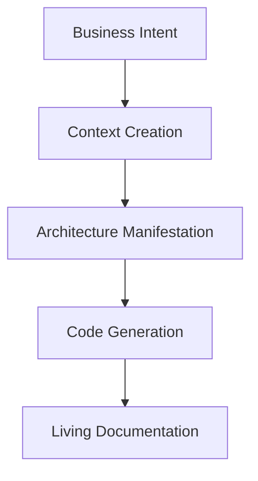

# 🧠 PAELLADOC: The AI-First Development Framework


[](https://github.com/jlcases/paelladoc)
[](https://x.com/i/communities/1907494161458090406)

> **Version 0.3.0**: This release marks a significant step, focusing PAELLADOC as an implementation of Anthropic's **Model Context Protocol (MCP)**, enabling powerful AI-First development workflows through LLM interaction.

> "In the AI era, context isn't supplementary to code—it's the primary creation."

PAELLADOC is an **AI-First Development framework** that implements the [5 Philosophical Principles of AI-First Development](https://paelladoc.com/blog/ai-first-development-principles/), transforming how we create software in the age of AI.

## 🎯 PAELLADOC and the Model Context Protocol (MCP)

PAELLADOC implements Anthropic's **Model Context Protocol (MCP)** ([see Anthropic's news](https://www.anthropic.com/news/model-context-protocol)). This protocol provides a structured way for Large Language Models (LLMs) to interact with external tools and context, enabling more sophisticated capabilities.

By implementing MCP, PAELLADOC allows LLMs to leverage its specific AI-First development tools and workflows directly through this standard. This approach facilitates functionalities similar to **Tool Use** or **Function Calling** seen in other platforms, but specifically utilizes the Anthropic MCP standard for interaction.

## 🎯 The AI-First Philosophy

Traditional development treats documentation as an afterthought. AI-First Development inverts this paradigm:
- Context becomes the primary artifact
- Code becomes its manifestation
- Knowledge evolves alongside systems
- Decisions preserve their philosophical context
- Human-AI collaboration is seamless

## 🧠 The Five Principles in Action

### 1. Context as Primary Creation
```python
# Traditional Way
write_code() -> document()

# PAELLADOC Way
create_context() -> manifest_as_code()
```
- Every artifact has a UUID for perfect traceability
- Context is versioned alongside code
- Knowledge graphs capture relationships
- Intent is preserved at every step

### 2. Intent-Driven Architecture

- Architecture flows from intent, not implementation
- Every decision captures its philosophical context
- Systems adapt to evolving purpose

### 3. Knowledge as Living Entity
```bash
# Knowledge evolves with your system
paella continue my-project
```
- Project memory tracks evolution of understanding
- Documentation updates automatically with changes
- Context remains fresh and relevant
- Knowledge graphs show relationships

### 4. Human-AI Collaborative Consciousness
```python
# Not just code generation, but true collaboration
with paelladoc.context() as ctx:
    ctx.understand_intent()
    ctx.propose_solutions()
    ctx.implement_with_human()
```
- Natural language conversations
- Intent preservation
- Contextual awareness
- Seamless collaboration

### 5. Contextual Decision Architecture
```yaml
decision:
  id: uuid-123
  intent: "Why we chose this path"
  context: "What we knew at the time"
  alternatives: "What we considered"
  implications: "Future impact"
```
- Every decision preserves its context
- Future developers understand the "why"
- Changes respect historical context
- Intent remains clear

## 🚀 Installation & Integration

PAELLADOC is a Python application and should be installed in its own **dedicated Python virtual environment**. This keeps its dependencies separate and avoids conflicts. You'll need *one* PAELLADOC environment, regardless of how many different projects (Python, JS, Ruby, etc.) you plan to document.

*(Requires Python 3.12 or later)*

### 1. Create and Activate the Dedicated Environment

First, choose a permanent location for this environment. Your home directory is often a good choice.

```bash
# Navigate to where you want to store the environment (e.g., your home directory)
# cd ~  # Uncomment and run if you want it in your home directory

# Create the virtual environment (using python3.12 or your installed 3.12+ version)
# We'll name the folder '.paelladoc_venv' (starting with a dot makes it hidden)
python3.12 -m venv .paelladoc_venv

# Activate the environment 
# (The command depends on your shell. Use ONE of the following)

# For Bash/Zsh:
source .paelladoc_venv/bin/activate

# For Fish:
# source .paelladoc_venv/bin/activate.fish

# For Powershell (Windows):
# .\.paelladoc_venv\Scripts\activate.ps1 
```
*(You should see `(.paelladoc_venv)` at the beginning of your terminal prompt now)*

### 2. Install PAELLADOC in the Activated Environment

```bash
# Make sure your (.paelladoc_venv) prompt is visible before running pip
pip install paelladoc
```

### 3. Configure Your LLM (MCP Setup)

Now, tell your LLM tool (like Cursor) how to *find and run* the PAELLADOC you just installed inside its dedicated environment. This involves editing the tool's MCP JSON configuration file.

**Key Information Needed:**

*   **The Full Path to the Python Executable:** You need the absolute path to the `python` file *inside* the `.paelladoc_venv/bin` (or `Scripts` on Windows) directory you created.
    *   If you created it in your home directory (`~`), the path will likely be `/Users/your_username/.paelladoc_venv/bin/python` on macOS/Linux or `C:\\Users\\your_username\\.paelladoc_venv\\Scripts\\python.exe` on Windows. **Replace `your_username` accordingly!**
    *   *Tip:* While the venv is active, you can often find the path by running `which python` (macOS/Linux) or `where python` (Windows).
*   **Database Location (Optional):** By default, PAELLADOC stores its memory database in `~/.paelladoc/memory.db`. You can override this using the `PAELLADOC_DB_PATH` environment variable in the MCP configuration if needed.

#### Cursor IDE Example
```json
# Edit your .cursor/mcp.json file:
{
  "mcpServers": {
    "paelladoc": {
      "command": "/Users/your_username/.paelladoc_venv/bin/python", 
      "args": [
        "-m",
        "paelladoc.ports.input.mcp_server_adapter",
        "--stdio"
      ],
      "env": {
      }
    }
    // ... other servers
  }
}
```

#### Other LLMs (Claude, Copilot, etc.)
Configure the tool use settings similarly, always ensuring the `command` points to the **full path** of the Python executable inside your dedicated `.paelladoc_venv`. The exact JSON structure might vary slightly between platforms.

```json
// Example structure (adapt as needed):
{
  // ... platform specific tool definition ...
  "command": "/Users/your_username/.paelladoc_venv/bin/python",
  "args": [ "-m", "paelladoc.ports.input.mcp_server_adapter", "--stdio" ],
  "env": {
  }
  // ...
}
```

### 4. Let the LLM Guide You

Once connected, your LLM will have access to all PAELLADOC commands:

- `PAELLA`: Start new documentation projects
- `CONTINUE`: Continue existing documentation
- `VERIFY`: Verify documentation coverage
- `GENERATE`: Generate documentation or code

The LLM will handle all the complexity - you just need to express your intent in natural language!

## 🚦 Version Stability

*   **PyPI Version (Stable):** The versions published on PyPI (`pip install paelladoc`) are stable releases recommended for general use.
*   **GitHub Repository (Development):** The `main` branch (and other branches) on the [GitHub repository](https://github.com/jlcases/paelladoc) contains the latest development code. This version may include new features or changes that are not yet fully tested and should be considered unstable. Use this version if you want to try out cutting-edge features or contribute to development.

## 🚀 Quick Start

1.  **Ensure PAELLADOC is installed** (`pip install paelladoc`) and **configured** in your LLM's tool/MCP settings (see examples above).
2.  **Start interacting with PAELLADOC** through your LLM by issuing a command. The primary command to initiate a new project or list existing ones is `PAELLA`.

    *   **In Cursor or a similar chat interface, simply type:**
        ```
        PAELLA
        ```
    *   **Alternatively, you can instruct the LLM more explicitly:**
        ```
        Use PAELLADOC to start documenting a new project.
        ```
        ```
        Tell PAELLADOC I want to create documentation.
        ```

3.  **Follow the LLM's lead:** PAELLADOC (via the LLM) will then guide you through the process interactively, asking for project details, template choices, etc.

## ⚙️ Available Commands (v0.3.1)

This version provides the following core commands, exposed via MCP for interaction with your LLM:

*   **`ping`**: 
    *   **Description:** Basic health check to confirm the server is running and responsive.
    *   **Arguments:** None (or optional `random_string`).
    *   **Returns:** `{ "status": "ok", "message": "pong" }`.

*   **`paella_init`**:
    *   **Description:** Initializes a new PAELLADOC project, creating the necessary structure and initial memory file.
    *   **Arguments:** `base_path` (str), `documentation_language` (str, e.g., "es-ES"), `interaction_language` (str, e.g., "en-US"), `new_project_name` (str).
    *   **Returns:** Dictionary confirming project creation status, name, and path.

*   **`paella_list`**:
    *   **Description:** Lists the names of all existing PAELLADOC projects found in the memory database.
    *   **Arguments:** None.
    *   **Returns:** Dictionary containing a list of project names (`projects`).

*   **`paella_select`**:
    *   **Description:** Selects an existing PAELLADOC project to work on (loads its memory).
    *   **Arguments:** `project_name` (str).
    *   **Returns:** Dictionary confirming project selection and its base path.

*   **`core_continue`**:
    *   **Description:** Continues work on a previously selected project, loading its memory and suggesting next steps (basic implementation).
    *   **Arguments:** `project_name` (str).
    *   **Returns:** Dictionary with project status and suggested next step.

*   **`core_help`**:
    *   **Description:** Provides help information about available commands (basic stub implementation).
    *   **Arguments:** None (future: specific command).
    *   **Returns:** Placeholder success message.

*   **`core_list_projects`**:
    *   **Description:** (Likely redundant with `paella_list`) Lists the names of existing PAELLADOC projects.
    *   **Arguments:** `db_path` (str, optional, for testing).
    *   **Returns:** Dictionary containing a list of project names (`projects`).

*   **`core_verification`**:
    *   **Description:** Checks documentation quality and completeness (basic stub implementation).
    *   **Arguments:** None.
    *   **Returns:** Placeholder success message.

## 🗺️ Future Roadmap Highlights

Based on the [Unified Roadmap](instructions/roadmap_unified.md), future versions aim to include:

*   Full interactive documentation generation flows (`GENERATE-DOC`).
*   Code analysis and context generation (`GENERATE_CONTEXT`).
*   Automatic code generation from documentation (`code_generation`).
*   Management of coding styles and Git workflows (`styles.coding_styles`, `styles.git_workflows`).
*   Project memory commands for decisions, issues, achievements (`DECISION`, `ISSUE`, `ACHIEVEMENT`).
*   And much more, aligning with the MECE taxonomy and A2A capabilities.

## 📊 MECE Documentation Structure

Our AI-First taxonomy ensures complete context preservation:
```