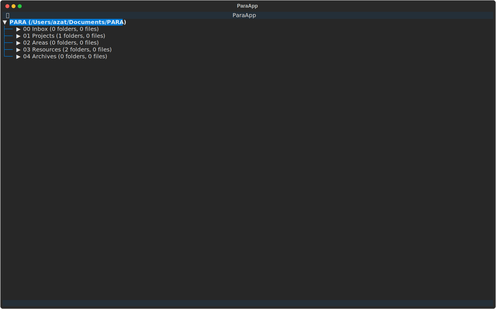

# PARA CLI

A command-line tool for managing your personal knowledge using the PARA method (Projects, Areas, Resources, Archive).

> ⚠️ **Development Status**: This project is currently under active development. Features and interfaces may change significantly between versions. Please check the releases page for stable versions and breaking changes.


## Installation

Install para-cli using uv (recommended for reliable installation and dependency management):

```bash
uv tool install para-cli
```

This will install para-cli globally in an isolated environment, ensuring all dependencies are properly managed.

⚠️ Note: Direct installation via pip is not recommended as it may cause system dependency conflicts.

Requirements:
- Python 3.13 or later
- uv package manager (install from https://github.com/astral-sh/uv)

## Usage

### Interactive Mode

The easiest way to manage your PARA system is through the interactive mode:



### Initialize PARA Structure

Create the basic PARA directory structure:

```bash
para init
```

You can also specify a custom location:

```bash
para init --path ~/Documents/PARA
```

### Check Status

View the current status of your PARA system:

```bash
para status
```

### Add New Items

Add a new item to any PARA category:

```bash
para add "New Project" projects
para add "Health" areas
para add "Programming Books" resources
para add "Old Project 2023" archive
```

## PARA Method Overview

The PARA method is a simple but powerful organizational system:

- **Projects**: Short-term efforts that you're currently working on
- **Areas**: Long-term responsibilities you want to manage
- **Resources**: Topics or themes of ongoing interest
- **Archive**: Inactive items from the other categories

## Development

Requirements:
- Python 3.13+
- Dependencies: typer, rich, textual

To contribute:
1. Clone the repository
2. Install dependencies: `uv pip install -e .`
3. Make your changes
4. Submit a pull request

## License

MIT License