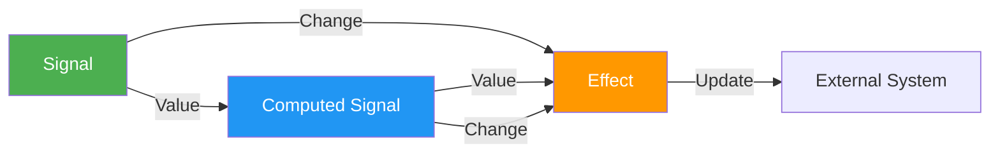

# reaktiv

 [](https://pypi.org/project/reaktiv/)    [](https://microsoft.github.io/pyright/)

**Reactive Signals for Python** with first-class async support, inspired by Angular's reactivity model.


## Documentation

Full documentation is available at [https://reaktiv.readthedocs.io/](https://reaktiv.readthedocs.io/).

## Why reaktiv?

If you've worked with modern frontend frameworks like React, Vue, or Angular, you're familiar with the power of reactive state management. The idea is simple but transformative: when data changes, everything that depends on it updates automatically. This is the magic behind dynamic UIs and real-time systems.

But why should Python miss out on the benefits of reactivity? `reaktiv` brings these **reactive programming** advantages to your Python projects:

- **Automatic state propagation:** Change a value once, and all dependent computations update automatically.
- **Efficient updates:** Only the necessary parts are recomputed.
- **Async-friendly:** Seamlessly integrates with Python's `asyncio` for managing real-time data flows.
- **Zero external dependencies:** Lightweight and easy to incorporate into any project.
- **Type-safe:** Fully annotated for clarity and maintainability.

### Real-World Use Cases

Reactive programming isn't just a frontend paradigm. In Python, it can simplify complex backend scenarios such as:

- **Real-time data streams:** Stock prices, sensor readings, or live updates.
- **User session management:** Keep track of state changes without heavy manual subscription management.
- **Complex API workflows:** Automatically cascade changes across related computations.

By combining these features, `reaktiv` provides a robust foundation for building **reactive, real-time systems** - whether for data streaming, live monitoring, or even Python-powered UI frameworks.

## How it Works

`reaktiv` provides three core primitives:

1. **Signals**: Store a value and notify dependents when it changes.
2. **Computed Signals**: Derive values that automatically update when dependencies change.
3. **Effects**: Run side effects when signals or computed signals change.

## Core Concepts



## Installation

```bash
pip install reaktiv
# or with uv
uv pip install reaktiv
```

## Quick Start

### Basic Reactivity

```python
import asyncio
from reaktiv import signal, effect

async def main():
    name = signal("Alice")

    async def greet():
        print(f"Hello, {name()}!")

    # Create and schedule effect
    # IMPORTANT: Assign the effect to a variable to ensure it is not garbage collected.
    greeter = effect(greet)

    name.set("Bob")  # Prints: "Hello, Bob!"
    await asyncio.sleep(0)  # Process effects

asyncio.run(main())
```

### Using `update()`

Instead of calling `set(new_value)`, `update()` lets you modify a signal based on its current value.

```python
from reaktiv import signal

counter = signal(0)

# Standard way
counter.set(counter() + 1)

# Using update() for cleaner syntax
counter.update(lambda x: x + 1)

print(counter())  # 2
```

### Computed Values

```python
from reaktiv import signal, computed

# Synchronous context example
price = signal(100)
tax_rate = signal(0.2)
total = computed(lambda: price() * (1 + tax_rate()))

print(total())  # 120.0
tax_rate.set(0.25)
print(total())  # 125.0
```

### Async Effects

```python
import asyncio
from reaktiv import signal, effect

async def main():
    counter = signal(0)

    async def print_counter():
        print(f"Counter value is: {counter()}")

    # IMPORTANT: Assign the effect to a variable to prevent it from being garbage collected.
    counter_effect = effect(print_counter)

    for i in range(1, 4):
        await asyncio.sleep(1)  # Simulate an asynchronous operation or delay.
        counter.set(i)

    # Wait a bit to allow the last effect to process.
    await asyncio.sleep(1)

asyncio.run(main())
```

### Synchronous Effects

`effect` works with both async and sync functions. If you don't need async functionality, you can use it without asyncio:

```python
from reaktiv import signal, effect

# Create signals
counter = signal(0)

# Define a synchronous effect function
def log_counter():
    print(f"Counter value: {counter()}")

# Create and schedule the effect
counter_effect = effect(log_counter) # Prints: "Counter value: 0"

# Update the signal
counter.set(1)  # Immediately prints: "Counter value: 1"

# No asyncio needed for synchronous effects!
```

---

## Advanced Features

### Using `untracked()`

By default, when you access a signal inside a computed function or an effect, it will subscribe to that signal. However, sometimes you may want to access a signal **without tracking** it as a dependency.

```python
import asyncio
from reaktiv import signal, effect, untracked

async def main():
    count = signal(10)
    message = signal("Hello")

    async def log_message():
        tracked_count = count()
        untracked_msg = untracked(lambda: message())  # Not tracked as a dependency
        print(f"Count: {tracked_count}, Message: {untracked_msg}")

    log_effect = effect(log_message)

    count.set(20)  # Effect runs (count is tracked)
    await asyncio.sleep(1)
    message.set("New Message")  # Effect does NOT run (message is untracked)

    await asyncio.sleep(1)

asyncio.run(main())
```

---

### Using `on_cleanup()`

Sometimes, you need to clean up resources (e.g., cancel timers, close files, reset state) when an effect re-runs or is disposed.

```python
import asyncio
from reaktiv import signal, effect

async def main():
    active = signal(False)

    async def monitor_status(on_cleanup):
        print("Monitoring started")
        active()

        def cleanup():
            print("Cleaning up before next run or disposal")

        on_cleanup(cleanup)

    monitor_effect = effect(monitor_status)

    await asyncio.sleep(1)
    active.set(True)  # Cleanup runs before the effect runs again

    await asyncio.sleep(1)
    monitor_effect.dispose()  # Cleanup runs before the effect is disposed

asyncio.run(main())

# Output:
# Monitoring started
# Cleaning up before next run or disposal
# Monitoring started
# Cleaning up before next run or disposal
```

### Custom Equality

When creating a Signal or ComputeSignal, you can provide a custom equality function to control when updates are triggered. This is useful for comparing objects by value rather than identity.

```python
from reaktiv import signal

# Simple example: compare numbers with tolerance
num = signal(10.0, equal=lambda a, b: abs(a - b) < 0.5)

# This won't trigger updates since 10.0 and 10.3 are within 0.5 of each other
num.set(10.3)  

# This will trigger updates since 10.0 and 10.6 differ by more than 0.5
num.set(10.6)  

# Custom class comparison example
class User:
    def __init__(self, name, role):
        self.name = name
        self.role = role
        
# By default, different User instances are considered different even with same data
# Let's create a signal with custom equality that only cares about the role
user = signal(User("Alice", "admin"), 
              equal=lambda a, b: a.role == b.role)

# This won't trigger updates because the role is still "admin"
# even though it's a different User instance with a different name
user.set(User("Bob", "admin"))

# This will trigger updates because the role changed
user.set(User("Charlie", "user"))

# For deep equality with nested structures, a simple JSON-based approach works well:
import json

def json_equal(a, b):
    return json.dumps(a, sort_keys=True) == json.dumps(b, sort_keys=True)

# This signal will only update when the content actually changes, 
# even for complex nested structures
user_profile = signal({
    'name': 'Alice',
    'preferences': {'theme': 'dark', 'notifications': True}
}, equal=json_equal)

changed = effect(lambda: print("User profile updated:", user_profile.get()))

# This won't trigger updates (same content in a new object)
user_profile.set({
    'name': 'Alice',
    'preferences': {'theme': 'dark', 'notifications': True}
})

# This will trigger updates (content changed)
user_profile.set({
    'name': 'Alice',
    'preferences': {'theme': 'light', 'notifications': True}
})
```

---

## Operators

Reaktiv provides operators to create new signals based on transformations of existing ones:

*   `filter_signal(source, predicate)`: Creates a signal that only emits values from the `source` when the `predicate` function returns `True`.
*   `debounce_signal(source, delay_seconds)`: Creates a signal that emits a value only after a specified `delay_seconds` has passed without the `source` emitting a new value.
*   `throttle_signal(source, interval_seconds, leading=True, trailing=False)`: Creates a signal that emits a value from the `source`, then ignores subsequent values for `interval_seconds`. `leading` and `trailing` flags control emission timing.
*   `pairwise_signal(source, emit_on_first=False)`: Creates a signal that emits tuples of `(previous_value, current_value)` from the `source`. If `emit_on_first` is `True`, it emits `(None, first_value)` on the first source emission. Otherwise (default), the first source emission is skipped.

```python
import asyncio
from reaktiv import signal, filter_signal, debounce_signal, throttle_signal, pairwise_signal, effect

async def main():
    source = signal(0) # Use shortcut

    # Filter: Only even numbers
    evens = filter_signal(source, lambda x: x % 2 == 0)
    even_effect = effect(lambda: print(f"Even: {evens()}"))

    # Debounce: Wait 50ms after last change
    debounced = debounce_signal(source, 0.05)
    debounce_effect = effect(lambda: print(f"Debounced: {debounced()}"))

    # Throttle: Emit immediately, then wait 100ms
    throttled = throttle_signal(source, 0.1, leading=True, trailing=False)
    throttle_effect = effect(lambda: print(f"Throttled: {throttled()}"))

    # Pairwise: Emit previous and current value (default: skip first)
    pairs_skip_first = pairwise_signal(source) # emit_on_first=False
    pair_effect_skip = effect(lambda: print(f"Pairwise (skip first): {pairs_skip_first()}"))

    # Pairwise: Emit previous and current value (emit on first)
    pairs_emit_first = pairwise_signal(source, emit_on_first=True)
    pair_effect_emit = effect(lambda: print(f"Pairwise (emit first): {pairs_emit_first()}"))

    print("--- Setting 1, 2, 3 quickly ---")
    source.set(1) # pairs_skip_first: (0, 1), pairs_emit_first: (0, 1)
    await asyncio.sleep(0.01)
    source.set(2) # pairs_skip_first: (1, 2), pairs_emit_first: (1, 2)
    await asyncio.sleep(0.01)
    source.set(3) # pairs_skip_first: (2, 3), pairs_emit_first: (2, 3)
                  # Debounce will only get 3, Throttle got 1

    await asyncio.sleep(0.1) # Wait for debounce/throttle timers

    print("--- Setting 4 ---")
    source.set(4) # pairs_skip_first: (3, 4), pairs_emit_first: (3, 4)
                  # All operators will update

    await asyncio.sleep(0.1) # Wait again

    # Effects are kept alive by their references (even_effect, etc.)

# Initial output (order might vary slightly due to scheduling):
# Even: 0
# Debounced: 0
# Throttled: 0
# Pairwise (skip first): None
# Pairwise (emit first): (None, 0)  <-- Emits immediately due to emit_on_first=True
# --- Setting 1, 2, 3 quickly ---
# Throttled: 1 (leading)
# Pairwise (skip first): (0, 1)
# Pairwise (emit first): (0, 1)
# Even: 2
# Pairwise (skip first): (1, 2)
# Pairwise (emit first): (1, 2)
# Pairwise (skip first): (2, 3)
# Pairwise (emit first): (2, 3)
# --- (after 0.05s delay) ---
# Debounced: 3
# --- Setting 4 ---
# Even: 4
# Throttled: 4 (leading, interval passed)
# Pairwise (skip first): (3, 4)
# Pairwise (emit first): (3, 4)
# --- (after 0.05s delay) ---
# Debounced: 4

asyncio.run(main())
```

---

## Real-Time Example: Polling System

```python
import asyncio
from reaktiv import signal, computed, effect

async def main():
    candidate_a = signal(100)
    candidate_b = signal(100)
    
    total_votes = computed(lambda: candidate_a() + candidate_b())
    percent_a = computed(lambda: (candidate_a() / total_votes()) * 100)
    percent_b = computed(lambda: (candidate_b() / total_votes()) * 100)

    async def display_results():
        print(f"Total: {total_votes()} | A: {candidate_a()} ({percent_a():.1f}%) | B: {candidate_b()} ({percent_b():.1f}%)")

    async def check_dominance():
        if percent_a() > 60:
            print("Alert: Candidate A is dominating!")
        elif percent_b() > 60:
            print("Alert: Candidate B is dominating!")

    display_effect = effect(display_results)
    alert_effect = effect(check_dominance)

    for _ in range(3):
        await asyncio.sleep(1)
        candidate_a.set(candidate_a() + 40)
        candidate_b.set(candidate_b() + 10)
    
    await asyncio.sleep(1)

asyncio.run(main())
```

**Sample Output:**

```
Total: 200 | A: 100 (50.0%) | B: 100 (50.0%)
Total: 250 | A: 140 (56.0%) | B: 110 (44.0%)
Total: 300 | A: 180 (60.0%) | B: 120 (40.0%)
Total: 350 | A: 220 (62.9%) | B: 130 (37.1%)
Alert: Candidate A is dominating!
```

## Real-Time WebSocket API Example

This example demonstrates how `reaktiv` simplifies real-time data processing in web applications by automatically updating computed values and sending changes to clients:

```python
from fastapi import FastAPI, WebSocket
from reaktiv import signal, computed, effect
import asyncio
import uvicorn

app = FastAPI()

measurements = signal([])
average = computed(lambda: sum(measurements()) / len(measurements()) if measurements() else 0)
above_threshold = computed(lambda: [m for m in measurements() if m > average() * 1.1])

@app.websocket("/ws")
async def websocket_endpoint(websocket: WebSocket):
    await websocket.accept()
    
    async def send_updates():
        await websocket.send_json({
            "average": average(),
            "above_threshold": above_threshold()
        })
    
    update_client = effect(send_updates)
    
    async def add_data():
        while True:
            await asyncio.sleep(1)
            user_input = await websocket.receive_text()
            new_data = measurements() + [float(user_input)]
            measurements.set(new_data)
    
    await add_data()

if __name__ == "__main__":
    uvicorn.run("app:app", host="0.0.0.0", port=8000)
```

This example shows how:
1. Signals store measurement data that can be updated in real-time
2. Computed values automatically recalculate when measurements change
3. Effects automatically send updates to connected clients whenever values change
4. The entire reactive system operates with minimal boilerplate code

## Examples

You can find example scripts in the `examples` folder to help you get started with using this project.

---

**Inspired by** Angular Signals • **Built for** Python's async-first world • **Made in** Hamburg