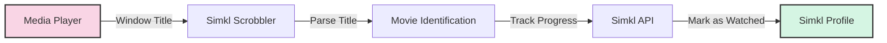

# 🎬 Simkl Scrobbler

[](https://www.python.org/downloads/)
[](https://opensource.org/licenses/MIT)
[]()
[](CONTRIBUTING.md)

A cross-platform automatic movie tracker that seamlessly integrates with [Simkl](https://simkl.com). It monitors your media players and automatically updates your watched history - no manual scrobbling required! ✨

<div align="center">
  
  <br/>
  <em>Your movies, automatically tracked whenever you watch them</em>
</div>

## ✨ Features

- 🎮 **Universal Media Player Support** - Works with VLC, MPV, MPC-HC, PotPlayer, and many others
- 🚀 **Zero Configuration** - Smart detection works out of the box
- 🌍 **Cross-Platform** - Full support for Windows, macOS, and Linux
- 🔄 **Multiple Run Modes** - Foreground, system tray, or background service
- 📊 **Position Tracking** - Monitors actual playback position for supported players
- 🔌 **Offline Support** - Queues updates when you're not connected
- 🧠 **Smart Detection** - Intelligent movie recognition from filenames

## ⚡ Quick Start

```bash
# 📥 Install
pip install simkl-scrobbler

# 🔑 Set up with your Simkl account
simkl-scrobbler init

# 🚀 Start tracking your movies
simkl-scrobbler start
```

## 📚 Documentation

For detailed instructions, please see the documentation:

- 📋 [Installation Guide](docs/installation.md)
- 🎮 [Usage Guide](docs/usage.md)
- 🎥 [Supported Media Players](docs/media-players.md)
- ⚙️ [Advanced Configuration](docs/configuration.md)
- 🔧 [Troubleshooting](docs/troubleshooting.md)
- 💻 [Development Guide](docs/development.md)
- 📝 [Todo List](docs/todo.md) - Completed and planned features

## 🔍 How It Works

The application monitors your active windows to detect media players, extracts the movie title, and uses the Simkl API to identify and track your watching progress. When you've watched enough of a movie (default: 80%), it's automatically marked as watched in your Simkl account! 🎉



## 📊 Supported Players

<div align="center">
  <table>
    <tr>
      <td align="center"><br/>VLC</td>
      <td align="center"><br/>MPC-HC</td>
      <td align="center"><br/>MPV</td>
      <td align="center">🎮<br/>Many More</td>
    </tr>
  </table>
</div>

## 📄 License

This project is licensed under the MIT License - see the [LICENSE](LICENSE) file for details.

## 👥 Contributing

Contributions are welcome! Please feel free to submit a Pull Request.

## 🙏 Acknowledgments

- [Simkl](https://simkl.com) for their excellent API
- [guessit](https://github.com/guessit-io/guessit) for powerful video filename parsing
- [iamkroot's Trakt Scrobbler](https://github.com/iamkroot/trakt-scrobbler/) for inspiration

---

<div align="center">
  <p>Made with ❤️ by <a href="https://github.com/kavinthangavel">kavinthangavel</a></p>
  <p>
    <a href="https://github.com/kavinthangavel/simkl-movie-tracker/stargazers">⭐ Star us on GitHub</a> •
    <a href="https://github.com/kavinthangavel/simkl-movie-tracker/issues">🐛 Report Bug</a> •
    <a href="https://github.com/kavinthangavel/simkl-movie-tracker/issues">✨ Request Feature</a>
  </p>
</div>

