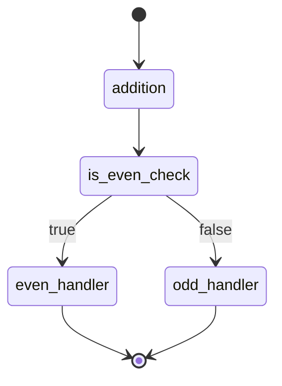

# WorkflowGraph

**WorkflowGraph** is a lightweight, self-contained Python library for building and executing directed graph workflows. It's an alternative to **LangGraph** for those seeking independence from LangChain and the flexibility to implement agent workflows, while still enabling real-time streaming of results.

The JavaScript-version is available at [https://github.com/dextersjab/workflow-graph.js]().

## Features

- **Graph-based workflows**: Build flexible, directed workflows where nodes are customizable tasks.
- **Synchronous & asynchronous support**: Define both sync and async nodes without any external dependencies.
- **Real-time streaming**: Built-in support for callbacks in each node, allowing real-time token streaming (e.g., for WebSockets).
- **LangGraph alternative**: Unlike LangGraph, WorkflowGraph provides a simpler, fully self-contained solution without needing LangChain for streaming.
- **Modular architecture**: Organized into separate modules for better maintainability and extensibility.
- **State-based workflow management**: Support for state-based workflows where each node receives and returns a state object.

## Installation

### From PyPI (Recommended)

```shell
pip install workflow-graph
```

### Latest Alpha/Beta Version

```shell
pip install workflow-graph --pre
```

> **Note**: The alpha/beta versions may include breaking changes as the API stabilizes.

### From GitHub

Add the following line to your `requirements.txt`:

```
git+https://github.com/dextersjab/workflow-graph.git@main
```

Then, run:

```shell
pip install -r requirements.txt
```

Or install directly using pip:

```shell
pip install git+https://github.com/dextersjab/workflow-graph.git@main
```

## Basic Usage

### Implementing a State-Based Workflow

Here's how to create a workflow using state management:

```python
import asyncio
from dataclasses import dataclass
from typing import Optional, List
from workflow_graph import WorkflowGraph, START, END

# Define your state class
@dataclass
class WorkflowState:
    input_value: int
    current_value: Optional[int] = None
    is_even: Optional[bool] = None
    result: Optional[str] = None
    errors: List[str] = None

    def __post_init__(self):
        if self.errors is None:
            self.errors = []

# Define task functions that work with state
def add(state: WorkflowState, callback=None) -> WorkflowState:
    result = state.input_value + 1
    if callback:
        callback(f"Added 1: {state.input_value} -> {result}")
    return WorkflowState(
        input_value=state.input_value,
        current_value=result,
        errors=state.errors
    )

def is_even(state: WorkflowState) -> bool:
    return state.current_value % 2 == 0

def handle_even(state: WorkflowState, callback=None) -> WorkflowState:
    result = f"Even: {state.current_value}"
    if callback:
        callback(result)
    return WorkflowState(
        input_value=state.input_value,
        current_value=state.current_value,
        is_even=True,
        result=result,
        errors=state.errors
    )

def handle_odd(state: WorkflowState, callback=None) -> WorkflowState:
    result = f"Odd: {state.current_value}"
    if callback:
        callback(result)
    return WorkflowState(
        input_value=state.input_value,
        current_value=state.current_value,
        is_even=False,
        result=result,
        errors=state.errors
    )

# Create and configure the workflow graph
graph = WorkflowGraph()

# Add nodes
graph.add_node("addition", add)
graph.add_node("is_even_check", is_even)
graph.add_node("even_handler", handle_even)
graph.add_node("odd_handler", handle_odd)

# Define starting point using add_edge
graph.add_edge(START, "addition")

# Define flow between nodes
graph.add_edge("addition", "is_even_check")

# Add conditional branching based on is_even_check result
graph.add_conditional_edges(
    "is_even_check", 
    path=is_even, 
    path_map={True: "even_handler", False: "odd_handler"}
)

# Set endpoints using add_edge
graph.add_edge("even_handler", END)
graph.add_edge("odd_handler", END)

# Compile the graph
compiled_graph = graph.compile()

# Execute the workflow
async def run_workflow(input_value):
    initial_state = WorkflowState(input_value=input_value)
    result = await compiled_graph.execute_async(initial_state, callback=print)
    print(f"Final Result: {result.result}")

# Run the workflow with different inputs
asyncio.run(run_workflow(5))  # Will output: "Even: 6"
asyncio.run(run_workflow(6))  # Will output: "Odd: 7"
```

This example creates a workflow that:
1. Takes a number as input and wraps it in a state object
2. Adds 1 to it, updating the state
3. Checks if the result is even
4. Branches to different handlers based on the result, each updating the state
5. Returns the final state with the result



### Error Handling and Retries

WorkflowGraph supports built-in error handling and retry capabilities:

```python
def make_api_request(state: WorkflowState) -> WorkflowState:
    try:
        # Make API request
        result = api_client.get_data(state.input_value)
        return WorkflowState(
            input_value=state.input_value,
            result=result,
            errors=state.errors
        )
    except Exception as e:
        state.errors.append(str(e))
        raise

def handle_api_error(state: WorkflowState) -> WorkflowState:
    return WorkflowState(
        input_value=state.input_value,
        result="Error occurred",
        errors=state.errors
    )

graph.add_node(
    "api_call", 
    make_api_request, 
    retries=3,                   # Retry up to 3 times on failure
    backoff_factor=0.5,          # Wait 0.5 seconds × attempt before retrying
    on_error=handle_api_error    # Call this function if all retries fail
)
```

## Execution Methods

Once your workflow is defined, there are two ways to execute it:

### Direct Execution (Simple)

For one-time executions, use the direct execution approach:

```python
# Execute synchronously
initial_state = WorkflowState(input_value=5)
result = graph.execute(initial_state)

# Or execute asynchronously with a callback
result = await graph.execute_async(initial_state, callback=some_callback)
```

### Compile-then-Execute (More Efficient for Multiple Executions)

For workflows that will be executed multiple times, compile once and reuse:

```python
# Compile the graph
compiled_graph = graph.compile()

async def run_workflow(input_value):
    initial_state = WorkflowState(input_value=input_value)
    result = await compiled_graph.execute_async(
        initial_state, 
        callback=lambda msg: print(f"Progress update: {msg}")
    )
    print(f"Final Result: {result.result}")

# Run the workflow with different inputs
asyncio.run(run_workflow(5))
asyncio.run(run_workflow(10))
```

## Generating Mermaid Diagrams

WorkflowGraph includes built-in support for generating [Mermaid.js](https://mermaid.js.org/) diagrams to visualize your workflow:

```python
# Generate Mermaid diagram code
mermaid_code = graph.to_mermaid()
print(mermaid_code)
```

The generated diagram uses dashed lines (`-.->`), rather than decision nodes, to represent conditional branches. This provides a cleaner and more accurate representation of how the workflow behaves.

Mermaid diagrams can be rendered in:
- GitHub Markdown (just paste the code)
- VS Code (with the Mermaid extension)
- Web browsers (using the Mermaid Live Editor)
- Many other tools that support Mermaid

## Package Structure

The library is organized into the following modules:

- **workflow_graph**: Main package
- **constants.py**: Defines constants like START and END
- **models.py**: Defines data structures like NodeSpec and Branch
- **builder.py**: Contains the WorkflowGraph class for building graphs
- **executor.py**: Contains the CompiledGraph class for executing workflows
- **exceptions.py**: Contains custom exceptions for better error handling
- **README.md**: Contains detailed documentation about the package internals

For backward compatibility, a top-level `workflow_graph.py` file is also provided that re-exports all the public API.

> **Note**:
> - For more technical details about the package internals, refer to the [src/workflow_graph/README.md](src/workflow_graph/README.md) file.
> - This project is largely AI-generated
