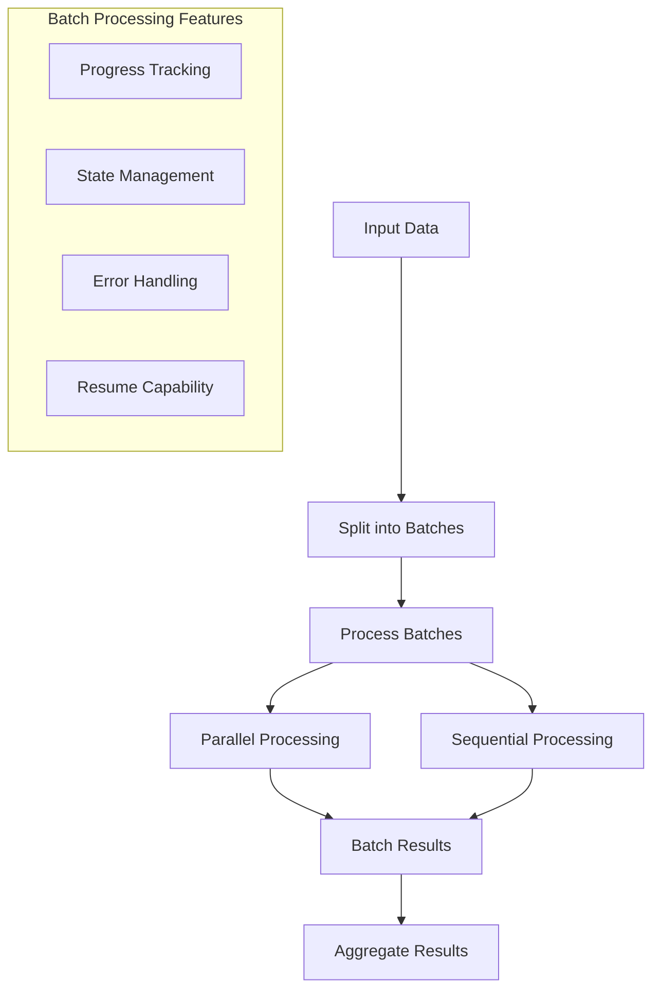
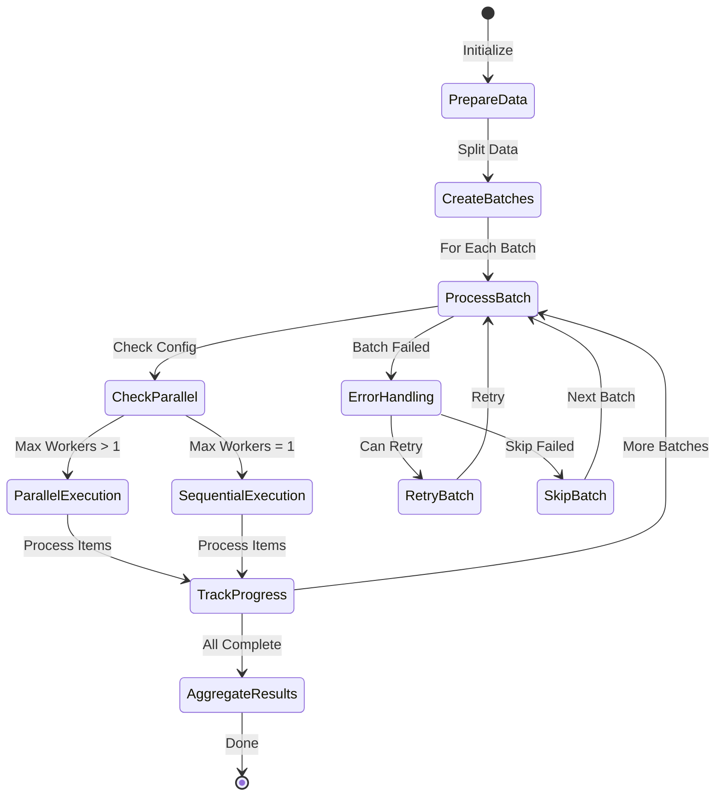
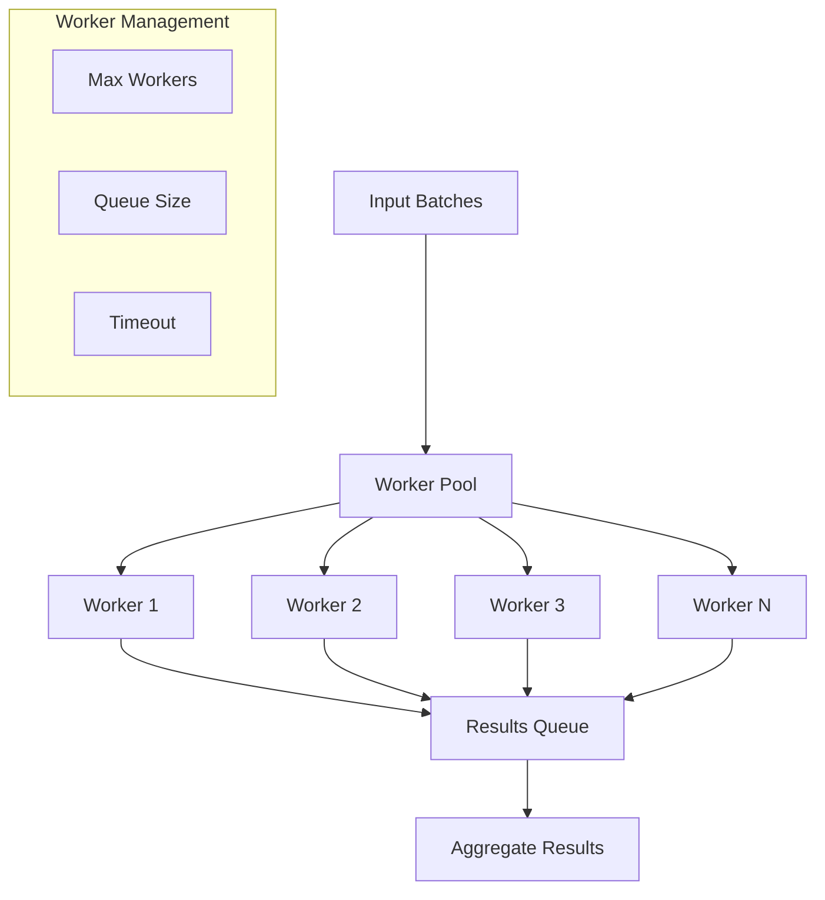
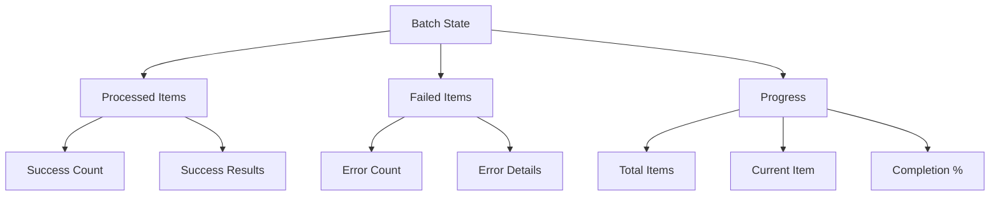
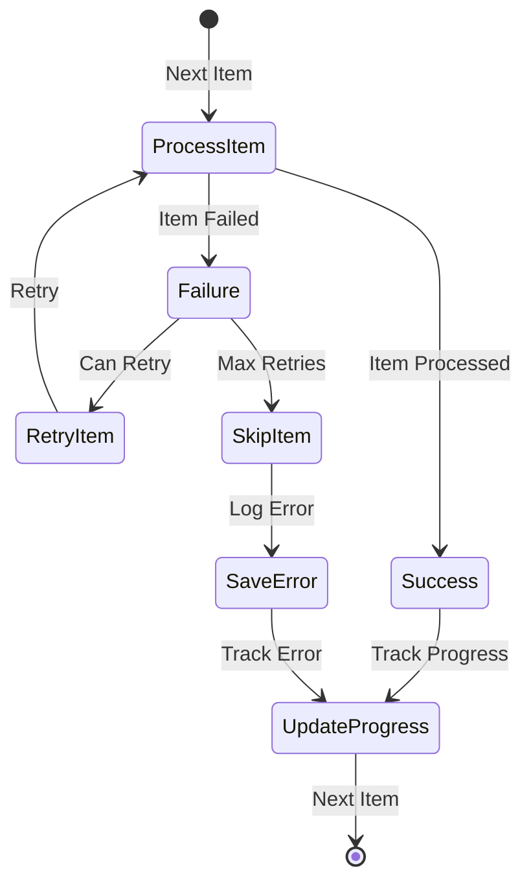

# Batch Processing Tasks

## Overview



## Batch Processing Flow



## Basic Usage

```yaml
steps:
  split_into_batches:
    type: python
    inputs:
      code: |
        numbers = params['numbers']
        batch_size = params['batch_size']
        batches = [numbers[i:i + batch_size] for i in range(0, len(numbers), batch_size)]
        result = batches

  process_batches:
    type: python
    for_each: "{{ steps.split_into_batches.result }}"
    inputs:
      operation: multiply
      item: "{{ item }}"
      factor: 2
    retry:
      max_attempts: 3
      delay: 5
```

## Parallel Processing Architecture



## State Management



## Error Handling and Recovery



## Best Practices

1. **Chunk Size**: Choose appropriate chunk sizes based on:
   - Available memory
   - Processing complexity
   - Required processing time
   
2. **State Management**:
   - Store progress information in the context
   - Use checkpoints for long-running operations
   - Implement resume capabilities

3. **Error Handling**:
   - Implement retry mechanisms
   - Log failed items
   - Provide cleanup steps

4. **Performance**:
   - Use parallel processing when appropriate
   - Monitor resource usage
   - Optimize batch sizes based on performance metrics

5. **Monitoring**:
   - Track progress regularly
   - Log important metrics
   - Implement alerting for failures

## Features

### Batch Configuration

Configure batch processing behavior:

```yaml
steps:
  - name: process_data
    task: batch
    inputs:
      # Items to process
      items: ["a", "b", "c", "d", "e"]
      
      # Batch size (items per batch)
      batch_size: 2
      
      # Enable parallel processing
      parallel: true
      
      # Maximum parallel processes
      max_parallel: 4
      
      # Continue on errors
      continue_on_error: false
      
      # Task to execute for each item
      task:
        type: shell
        command: "echo Processing {{ item }}"
```

### Item Processing

Process items using any available task type:

```yaml
steps:
  - name: transform_data
    task: batch
    inputs:
      items: ["file1.csv", "file2.csv", "file3.csv"]
      batch_size: 1
      task:
        type: python
        code: |
          import pandas as pd
          
          # Read CSV
          df = pd.read_csv(item)
          
          # Transform data
          result = df.groupby('category').sum()
          
          # Save result
          output_file = f"{item}.result.json"
          result.to_json(output_file)
          
          return {
              'input': item,
              'output': output_file,
              'rows': len(df)
          }
    outputs: processing_results
```

### Parallel Processing

Execute batches in parallel:

```yaml
steps:
  - name: parallel_process
    task: batch
    inputs:
      items: ["url1", "url2", "url3", "url4"]
      batch_size: 1
      parallel: true
      max_parallel: 2
      task:
        type: http_request
        url: "{{ item }}"
        method: GET
    outputs: responses
```

### Error Handling

Handle batch processing errors:

```yaml
steps:
  - name: process_with_errors
    task: batch
    inputs:
      items: ["item1", "item2", "item3"]
      continue_on_error: true
      on_item_error:
        task: echo
        inputs:
          message: "Failed to process {{ item }}: {{ error }}"
      task:
        type: shell
        command: "process_item.sh {{ item }}"
    outputs: results
```

## Best Practices

1. **Batch Size**
   - Choose appropriate batch sizes
   - Consider memory usage
   - Balance throughput and resource usage

2. **Parallel Processing**
   - Set reasonable max_parallel limits
   - Monitor system resources
   - Handle concurrent access

3. **Error Handling**
   - Implement proper error recovery
   - Log failed items
   - Consider retry strategies

4. **Performance**
   - Optimize individual item processing
   - Use efficient data structures
   - Monitor processing times

## Examples

### File Processing

```yaml
steps:
  - name: process_files
    task: batch
    inputs:
      # Get list of files
      items: $(ls data/*.csv)
      batch_size: 5
      parallel: true
      task:
        type: python
        code: |
          import pandas as pd
          from pathlib import Path
          
          # Read input file
          df = pd.read_csv(item)
          
          # Process data
          result = df.groupby('category').agg({
              'value': ['sum', 'mean', 'count']
          })
          
          # Save result
          output_file = Path(item).with_suffix('.json')
          result.to_json(output_file)
          
          return {
              'file': item,
              'records': len(df),
              'output': str(output_file)
          }
    outputs: processing_results
```

### API Requests

```yaml
steps:
  - name: fetch_data
    task: batch
    inputs:
      items: ["user1", "user2", "user3"]
      batch_size: 2
      parallel: true
      max_parallel: 3
      task:
        type: http_request
        url: "https://api.example.com/users/{{ item }}"
        method: GET
        headers:
          Authorization: "Bearer {{ env.API_TOKEN }}"
        retry:
          max_attempts: 3
          delay: 1
    outputs: user_data
```

### Data Transformation

```yaml
steps:
  - name: transform_records
    task: batch
    inputs:
      items: {{ input_records }}
      batch_size: 100
      task:
        type: python
        code: |
          def transform_record(record):
              return {
                  'id': record['id'],
                  'name': record['name'].upper(),
                  'score': float(record['score']),
                  'grade': 'A' if float(record['score']) >= 90 else 'B'
              }
          
          # Transform batch of records
          return [transform_record(r) for r in item]
    outputs: transformed_data
```

### Database Operations

```yaml
steps:
  - name: update_records
    task: batch
    inputs:
      items: {{ records_to_update }}
      batch_size: 50
      parallel: false  # Sequential for database operations
      task:
        type: python
        code: |
          import psycopg2
          from psycopg2.extras import execute_batch
          
          # Connect to database
          conn = psycopg2.connect(env.DB_URL)
          cur = conn.cursor()
          
          try:
              # Prepare statement
              stmt = """
                  UPDATE users
                  SET status = %(status)s,
                      updated_at = NOW()
                  WHERE id = %(id)s
              """
              
              # Execute batch update
              execute_batch(cur, stmt, item)
              conn.commit()
              
              return {
                  'updated': len(item),
                  'status': 'success'
              }
          finally:
              cur.close()
              conn.close()
    outputs: update_results
``` 