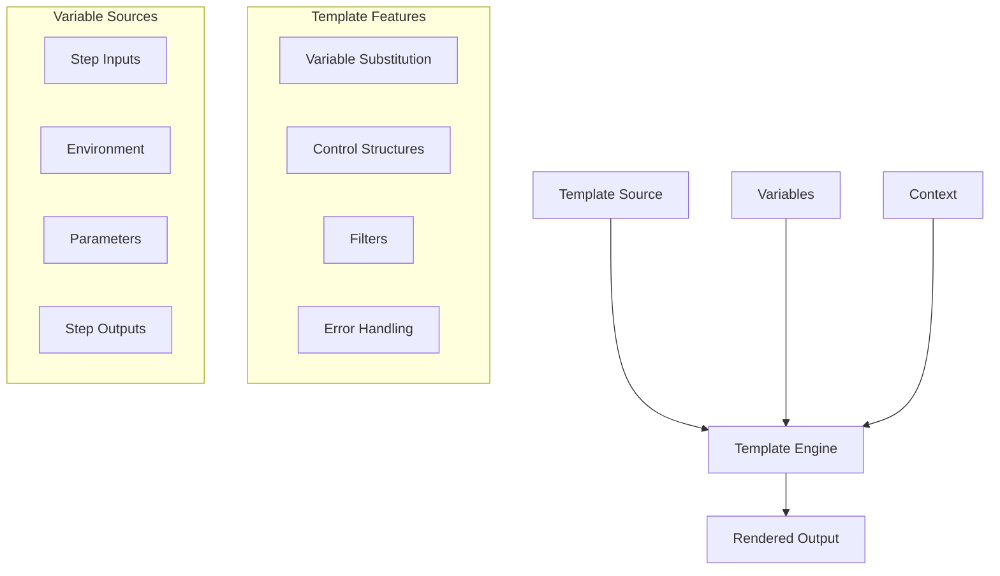
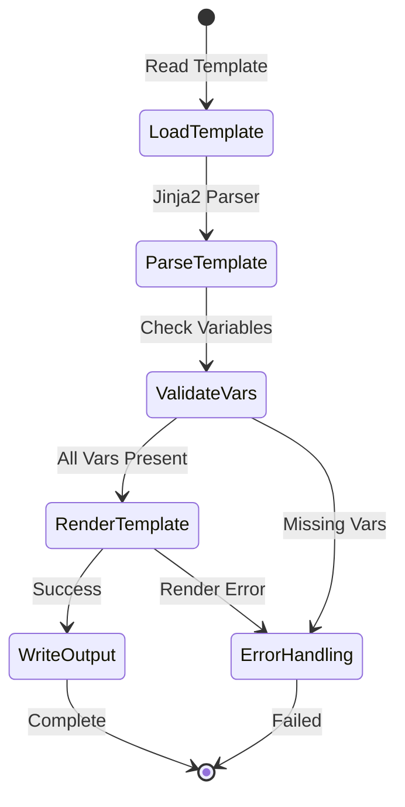

# Template Tasks

> For a comprehensive guide on templating syntax, features, and best practices, see the [Templating Guide](../templating.md).

## Overview



## Template Processing Flow



Template tasks provide powerful templating capabilities using Jinja2, allowing you to generate files and content with variable substitution and complex logic.

## Basic Usage

```yaml
steps:
  generate_config:
    type: template
    inputs:
      template: |
        app_name: {{ app_name }}
        environment: {{ env }}
        debug: {{ debug | lower }}
      variables:
        app_name: my-application
        env: production
        debug: True
      output_file: config.yaml
```

## Configuration Options

### Template Source
- `template`: Inline template string
- `template_file`: Path to template file
- `template_encoding`: Template file encoding (default: utf-8)

### Variable Handling
- `variables`: Dictionary of variables to use in template
- `strict_undefined`: Fail on undefined variables (default: true)
- `default_value`: Default value for undefined variables
- `filters`: Custom filter functions

### Output Configuration
- `output_file`: Path to output file (required)
- `output_mode`: Write mode (create/append/overwrite)
- `output_encoding`: Output file encoding (default: utf-8)
- `create_dirs`: Create parent directories (default: false)

### Error Handling
- `ignore_undefined`: Ignore undefined variables (default: false)
- `strict_mode`: Strict template processing (default: true)
- `error_on_missing_file`: Fail if template file missing (default: true)

## Template Features

### Variable Substitution
```yaml
steps:
  basic_substitution:
    type: template
    inputs:
      template: "Hello {{ name }}!"
      variables:
        name: World
      output_file: greeting.txt
```

### Conditional Logic
```yaml
steps:
  conditional_template:
    type: template
    inputs:
      template: |
        
        debug: false
        logging: error
        
        debug: true
        logging: debug
        
      variables:
        env: production
      output_file: app-config.yaml
```

### Loops and Iterations
```yaml
steps:
  loop_template:
    type: template
    inputs:
      template: |
        services:
        
          - name: {{ service.name }}
            port: {{ service.port }}
        
      variables:
        services:
          - name: web
            port: 8080
          - name: api
            port: 3000
      output_file: docker-compose.yaml
```

### Filters and Functions
```yaml
steps:
  filter_example:
    type: template
    inputs:
      template: |
        username: {{ username | lower }}
        path: {{ path | basename }}
        data: {{ data | tojson }}
      variables:
        username: JohnDoe
        path: /path/to/file.txt
        data:
          key: value
      output_file: config.yaml
```

### Template Inheritance
```yaml
steps:
  base_template:
    type: template
    inputs:
      template_file: base.yaml.j2
      variables:
        title: My App
        content: Hello World
      output_file: output.yaml
```

## Error Handling Examples

### Undefined Variables
```yaml
steps:
  strict_variables:
    type: template
    inputs:
      template: "{{ required_var }}"
      variables: {}
      strict_undefined: true
      output_file: output.txt
```

### Default Values
```yaml
steps:
  default_values:
    type: template
    inputs:
      template: "{{ optional_var | default('fallback') }}"
      variables: {}
      output_file: output.txt
```

## Best Practices

1. **Template Organization**:
   - Use template files for complex templates
   - Implement template inheritance for reusability
   - Keep templates DRY (Don't Repeat Yourself)

2. **Variable Management**:
   - Document required variables
   - Use descriptive variable names
   - Provide sensible defaults
   - Validate variable types

3. **Error Handling**:
   - Enable strict mode for development
   - Use default values for optional variables
   - Implement proper error handling
   - Validate template syntax

4. **Output Management**:
   - Use appropriate file permissions
   - Handle file conflicts gracefully
   - Clean up temporary files
   - Validate output content

5. **Security**:
   - Sanitize input variables
   - Avoid template injection
   - Use safe defaults
   - Restrict file access

## Built-in Variables

The template task provides access to:

1. **Workflow Variables**
   - `workflow_name`: Name of the workflow
   - `run_number`: Current run number
   - `workspace`: Workspace directory path

2. **Environment Variables**
   - Access using `env.VARIABLE_NAME`

3. **Parameters**
   - Access using `params.PARAM_NAME`

4. **Step Outputs**
   - Access using `steps.STEP_NAME.outputs.OUTPUT_NAME`

## Examples

### Configuration File

```yaml
steps:
  - name: generate_config
    task: template
    template: |
      # Configuration for {{ env.APP_NAME }}
      # Generated: {{ timestamp }}
      
      [database]
      host = {{ env.DB_HOST }}
      port = {{ env.DB_PORT }}
      name = {{ env.DB_NAME }}
      
      [api]
      url = {{ env.API_URL }}
      timeout = {{ env.API_TIMEOUT }}
      
      [logging]
      level = {{ env.LOG_LEVEL | default('INFO') }}
      file = {{ env.LOG_FILE | default('app.log') }}
    output: config.ini
```

### HTML Report

```yaml
steps:
  - name: create_report
    task: template
    template: |
      <!DOCTYPE html>
      <html>
      <head>
        <title>{{ title }}</title>
        <style>
          .success { color: green; }
          .error { color: red; }
        </style>
      </head>
      <body>
        <h1>{{ title }}</h1>
        <p>Generated: {{ timestamp }}</p>
        
        <h2>Results</h2>
        <table>
          <tr>
            <th>Test</th>
            <th>Status</th>
            <th>Duration</th>
          </tr>
          
          <tr>
            <td>{{ test.name }}</td>
            <td class="{{ test.status }}">{{ test.status }}</td>
            <td>{{ test.duration }}ms</td>
          </tr>
          
        </table>
        
        <h2>Summary</h2>
        <ul>
          <li>Total: {{ tests | length }}</li>
          <li>Passed: {{ tests | selectattr('status', 'eq', 'success') | list | length }}</li>
          <li>Failed: {{ tests | selectattr('status', 'eq', 'error') | list | length }}</li>
        </ul>
      </body>
      </html>
    output: report.html
```

### Email Template

```yaml
steps:
  - name: prepare_email
    task: template
    template: |
      Subject: {{ subject }}
      From: {{ sender }}
      To: {{ recipient }}
      Content-Type: text/html
      
      <html>
      <body>
        <h2>{{ subject }}</h2>
        
        <p>Dear {{ recipient_name }},</p>
        
        
        <p style="color: red;">
          Alert: {{ message }}
        </p>
        
        <p>
          {{ message }}
        </p>
        
        
        
        <h3>Details:</h3>
        <ul>
        
          <li><strong>{{ key }}:</strong> {{ value }}</li>
        
        </ul>
        
        
        <p>Best regards,<br>{{ sender_name }}</p>
      </body>
      </html>
    output: email.html
``` 