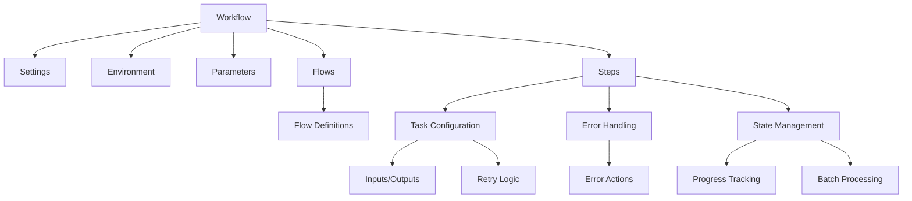
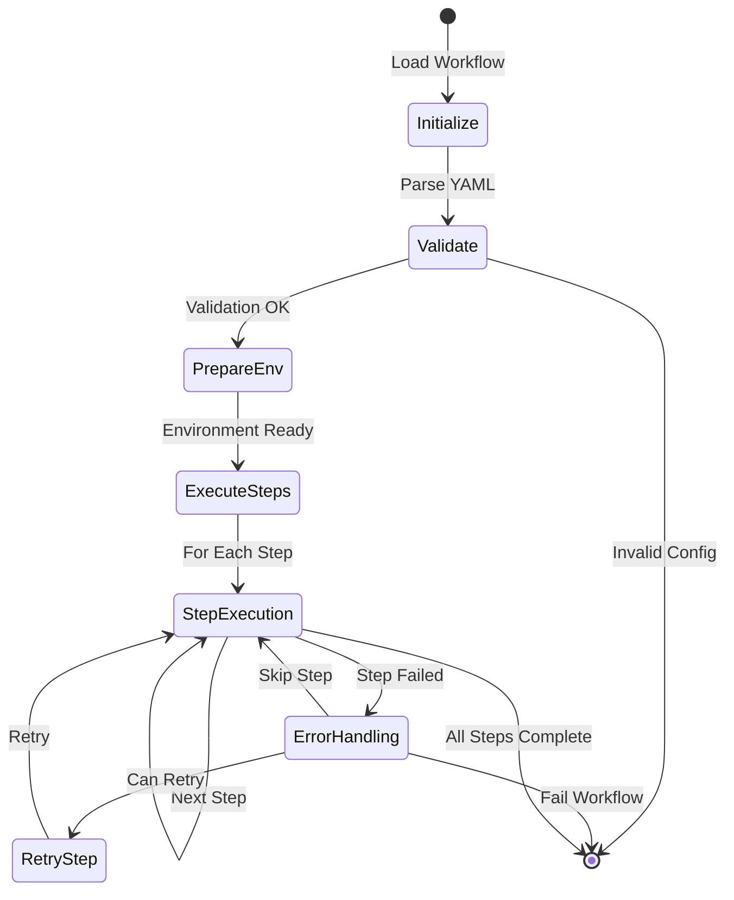
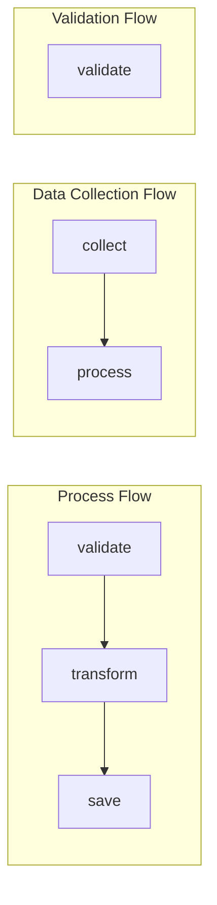

# Workflow Structure

## Component Overview



## Basic Structure
```yaml
name: My Workflow
description: Workflow description
version: "1.0"  # Optional

# Optional global settings
settings:
  error_handling:
    undefined_variables: strict
    show_available: true
  batch_processing:
    chunk_size: 10
    max_workers: 4

# Optional parameter definitions
params:
  input_file:
    description: Input file path
    type: string
    required: true
  batch_size:
    description: Number of items to process at once
    type: integer
    default: 10

# Optional flow definitions
flows:
  default: process  # Optional, defaults to "all" if not specified
  definitions:
    - process: [validate, transform, save]  # Main processing flow
    - data_collection: [collect, process]   # Data collection flow
    - validation: [validate]                # Validation flow

# Workflow steps
steps:
  - name: validate
    task: file_check
    description: Validate input file
    params:
      path: "{{ args.input_file }}"
      type: "csv"

  - name: transform
    task: python_code
    description: Transform data
    params:
      input: "{{ args.input_file }}"
      batch_size: "{{ args.batch_size }}"
    error_handling:
      undefined_variables: strict

## Workflow Lifecycle



## Variable Access

The workflow engine uses a namespaced approach for variable access. It's important to distinguish between the definition of parameters and their runtime access:

- **`params:` Block (YAML Definition):**
  - Located at the top level of your workflow YAML.
  - Used to *define* the parameters your workflow expects, including their type, description, default values, and whether they are required.
  - Example:
    ```yaml
    params:
      input_file:
        description: Input file path
        type: string
        required: true
      batch_size:
        description: Number of items to process at once
        type: integer
        default: 10
    ```

- **Runtime Namespaces (Template Access):**
  - **`args`**: Provides the *resolved runtime values* of parameters defined in the `params:` block, after merging with any overrides provided via the command line (using `name=value` format). Use `{{ args.PARAM_NAME }}` to access these values in templates.
  - **`env`**: Accesses environment variables (`{{ env.VAR_NAME }}`).
  - **`steps`**: Accesses outputs from previous steps (`{{ steps.STEP_NAME.result }}` or `{{ steps.STEP_NAME.result.KEY }}`).
  - **`workflow`**: Provides workflow-level information (`{{ workflow.workspace }}`, `{{ workflow.run_id }}`).
  - (Other namespaces like `batch`, `current` exist for specific contexts).

Example Template Access:
```yaml
steps:
  - name: process
    task: python_code
    params: # Note: 'params' under a step are task-specific inputs, not the workflow params
      # Access workflow parameters' runtime values via args namespace
      input_data: "{{ args.data_source }}"
      
      # Access environment variables
      api_url: "{{ env.API_URL }}"
      debug: "{{ env.DEBUG }}"
      
      # Access step outputs (standardized)
      data: "{{ steps.transform.result }}"
      metadata: "{{ steps.transform.result.metadata }}"
      
      # Access workflow information
      workspace: "{{ workflow.workspace }}"
      run_id: "{{ workflow.run_id }}"
```

## Flow Control

The workflow engine supports defining multiple flows within a single workflow. Each flow represents a specific sequence of steps to execute. This allows you to:

- Define different execution paths for different purposes
- Reuse steps across different flows
- Switch between flows via command line
- Resume failed flows from the last failed step

### Flow Configuration Example



```yaml
flows:
  # Optional default flow to use when no flow is specified
  default: process
  
  # Flow definitions
  definitions:
    - process: [validate, transform, save]
    - data_collection: [collect, process]
    - validation: [validate]

# Flow execution conditions
steps:
  - name: validate
    condition: "{{ args.input_file is defined }}"
  
  - name: transform
    condition: "{{ steps.validate.result.status == 'completed' }}"
```

## Error Handling

The workflow engine provides comprehensive error handling with improved error messages and strict variable checking:

```yaml
# Global settings for error handling
settings:
  error_handling:
    undefined_variables: strict  # Enable StrictUndefined behavior
    show_available: true        # Show available variables in error messages

steps:
  - name: template_task
    task: template
    error_handling:
      undefined_variables: strict  # Override at step level
      show_available: true
    params:
      template: "Hello {{ name }}!"  # Will fail if name is undefined
```

When `undefined_variables` is set to `strict`, the engine provides helpful error messages:

```yaml
settings:
  error_handling:
    undefined_variables: strict
    show_available: true  # Shows available env vars in errors
```

If an undefined environment variable is referenced, the error message will include:
- The name of the missing variable
- List of available environment variables
- Context where the error occurred

## Environment Variables

Environment variables in the workflow engine are handled through the workflow context and are accessible via the `env` namespace. The engine provides several ways to work with environment variables:

### Access Methods

1. **In Templates**
   ```yaml
   steps:
     - name: use_env
       task: template
       params:
         template: "API URL is {{ env.API_URL }}"
   ```

2. **In Python Tasks**
   ```yaml
   steps:
     - name: python_task
       task: python
       params:
         code: |
           import os
           result = os.environ.get('API_URL')
   ```

3. **In Shell Tasks**
   ```bash
   # Access args.input_file and env.API_KEY
   process_script.sh "{{ args.input_file }}" "{{ env.API_KEY }}"
   ```

4. **In Python Tasks** (`python_code` example)
   ```yaml
   steps:
     - name: process_data
       task: python_code # Updated
       inputs:
         code: |
           # Access args and env namespaces
           input_file = args.get('input_file')
           api_key = env.get('API_KEY')
           result = process(input_file, api_key)
   ```

### Batch Task Context (`batch`)

Available inside tasks executed by the `batch` task:

```yaml
steps:
  - name: process_batch
    task: batch
    inputs:
      items: ["A", "B", "C"]
      task:
        task: python_code # Updated
        inputs:
          code: |
            # Access batch context variables
            current_item = batch['item']
            item_index = batch['index']
            total_items = batch['total']
            print(f"Processing {current_item} ({item_index + 1}/{total_items})")
            result = current_item.lower()
```

</rewritten_file>